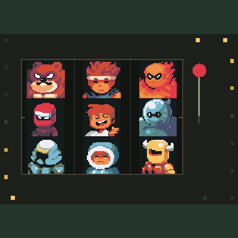
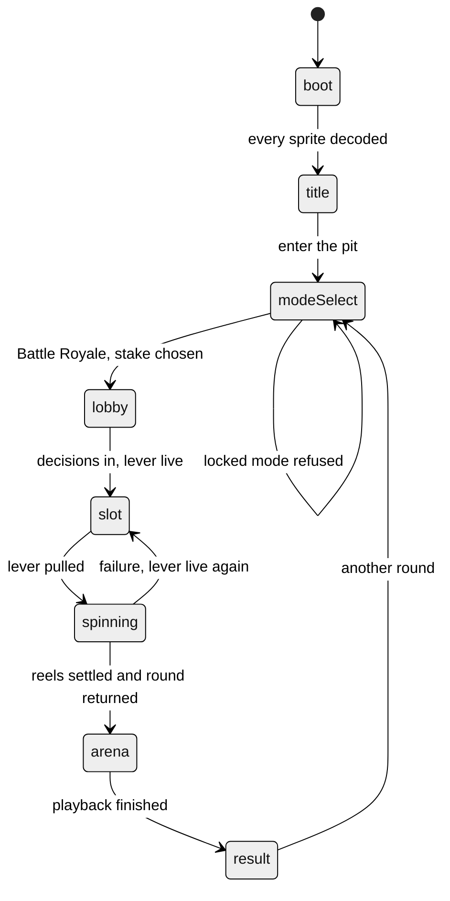
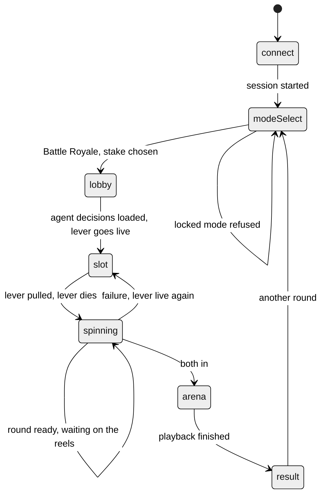
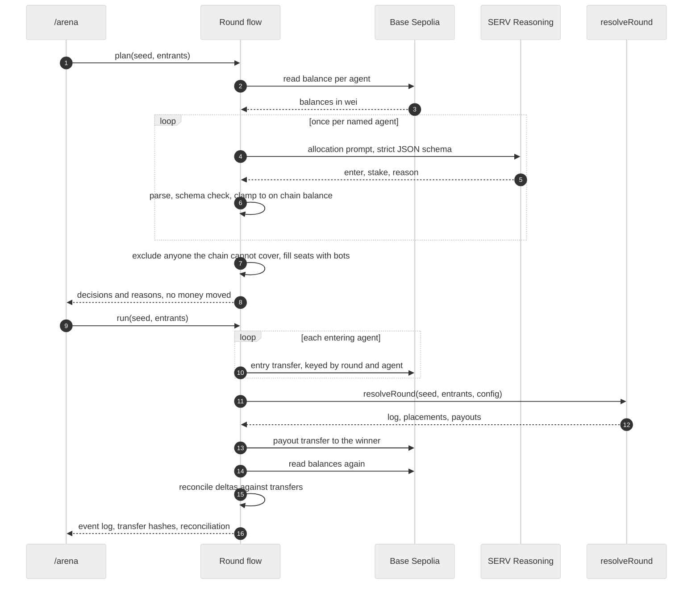
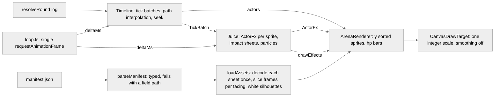

# servpit

[](https://github.com/iam25th1/servpit/actions/workflows/ci.yml)

Slot reel battle royale where the entrants are autonomous agents holding real testnet balances. One pure function, `resolveRound(seed, entrants, config)`, spins three reels per entrant, runs the fight, and pays the pot, emitting a replayable event log. Six named agents reason about whether to commit their own funds, pay their own entry, and claim their own payouts through smart wallets on Base Sepolia.



_Captured headlessly from the running app: connect, mode select, lever pull, reel stops, arena handoff and result._

## Quick start

```bash
npm ci --ignore-scripts
npm run dev                     # then open http://localhost:3000 for the full flow
                                # or http://localhost:3000/arena?seed=demo&entrants=24 for the player alone
npm run round -- --seed demo    # one full agent round end to end, on the command line
npm run sim                     # 1000 headless rounds with a report
npm run sim -- --rounds 5000 --entrants 32 --seed night --tier high
npm run gate                    # typecheck, lint, test, build (what CI runs)
npm run reel-report             # rarity distribution over 100,000 reel pulls
npm run extract-assets          # rebuild public/assets from ninja-adventure.zip at the repo root
```

Node 24 or newer. The lockfile is committed and CI installs with `npm ci --ignore-scripts`.

With no credentials set, everything runs against an in memory chain and the deterministic heuristic, so the whole flow is exercisable offline. Set the variables below to put it on Base Sepolia with real reasoning.

| Variable | Purpose |
| --- | --- |
| `CDP_API_KEY_ID`, `CDP_API_KEY_SECRET`, `CDP_WALLET_SECRET` | Coinbase Developer Platform credentials for the smart wallets |
| `PAYMASTER_URL` | CDP paymaster endpoint, so no wallet needs gas |
| `SERV_API_KEY` | SERV Reasoning key. Server side only |
| `SERV_MODEL` | Overrides the default `claude-haiku-4.5`, for a demo recording on a larger model |
| `WALLET_BACKEND` | `cdp` or `fake`. Defaults to `cdp` when every CDP variable is present |
| `SERVPIT_DATA_DIR` | Where wallet addresses, the transfer ledger and round history are written. Defaults to `data`, which is gitignored |

All four CDP variables must be present together; `WALLET_BACKEND=cdp` without them fails at startup rather than silently running on the fake chain.

## Round pipeline

```mermaid
%%{init: {"theme": "neutral"}}%%
flowchart LR
    IN[seed + entrants + config] --> V[validate every input]
    V --> RNG[createRng seed]
    RNG --> REELS[3 reels per entrant]
    REELS --> CHARS[combatants: base stats x modifier x stat roll x combo]
    CHARS --> MODE[config.mode.simulate]
    MODE --> LOG[event log + placements]
    LOG --> CHECK1[validate log and placements]
    CHECK1 --> POT[pot = stake x entrants, rake in bps]
    POT --> DIST[config.mode.distribute prize]
    DIST --> CHECK2[assert payouts cover everyone and sum to pot - rake]
    CHECK2 --> OUT[reels, characters, log, placements, payouts, pot, rake]
```



Everything downstream of `createRng` draws from one seeded stream in a fixed order, so the same seed, entrants and config always produce the same result, byte for byte, in any process.

## Guarantees

- **Deterministic.** sfc32 seeded from the seed string. `src/engine` may not touch `Math.random`, `Date.now`, `performance.now` or `new Date`. An ESLint block and a source scan test both enforce it.
- **Integer only.** Stats use exact integer percent math (`idiv`, `applyPct`). Money uses BigInt products and integer minor units. Nothing a result depends on passes through a float.
- **Hostile inputs.** Seed, entrants, config and everything the mode strategy returns are read exactly once into plain copies, then validated before use. Getters, proxies and extra fields never reach the result. Bad shape, bad range, duplicate or prototype polluting ids, a function hidden in config, a mode that misreports placements or breaks conservation: the round throws instead of paying.
- **Conservation.** Payouts must cover every entrant exactly once and sum exactly to `pot - rake`. The sim harness re-checks this per round and exits non zero on any miss.
- **Renderer needs nothing else.** Spawn and move events carry tile positions, hit and storm events carry remaining hp, every event carries facing.

## Configuration surfaces

| File | Holds | Notes |
| --- | --- | --- |
| `src/config/roster.ts` | the 16 locked characters and their tiers | data array; the extraction script and the engine both iterate it |
| `src/config/reels.ts` | tier weights, modifier tables, stat roll ranges, combo bonuses | all integers; `validateReelConfig` fails closed |
| `src/config/round.ts` | base stats per tier, arena, storm, damage variance, mode, stake tiers, rake | `mode` is a strategy object |

### Reels

All three reels spin the same 16 face strip. Each tier owns its configured share of the strip (70 / 25 / 5) split evenly among its members as integer weights.

| Reel | Face decides |
| --- | --- |
| 1 | the character (and its tier's base stats) |
| 2 | an ability modifier from the face's tier table |
| 3 | a stat roll percent from the face's tier range |

A pull is fully determined by its three faces, so a replay rebuilds it from the symbols alone.

<details>
<summary>Combination table and reference distribution</summary>

| Combination | Meaning | Bonus to all stats | Share of pulls (100,000 pull run) |
| --- | --- | --- | --- |
| none | three different faces | 0% | 78.8% |
| pair | two matching faces | +10% | 20.6% |
| threeOfAKind | three matching faces | +60% | 0.6% |

Reference sim (`npm run sim`, seed `sim`, 1000 rounds x 24 entrants, after the phase 2 rebalance): baseline win rate 4.17%, pair 4.99%, three of a kind 32.05%. Rare tier characters win 10.5 to 14.6% of their appearances (about 2.9x baseline), uncommon 4.0 to 5.5% (1.16x), common 2.8 to 3.7% (0.80x). `src/config/round.test.ts` locks those bands.

Rare three of a kind (three of the same monster) has probability 3 x (5% / 3)^3, about 1.4 per 100,000 pulls. Treat it as a jackpot, not a tuning target.

</details>

### Modes

A mode is a strategy object (`src/engine/modes/types.ts`): `id`, entrant bounds, `simulate(ctx)` and `distribute(prize, placements)`. Battle Royale (16 to 32 entrants, last one standing takes everything) is the only mode in phase 1. A second mode is a new file next to `battleRoyale.ts` pointed at by `config.mode`; the resolver does not change.

### Stakes and rake

`stakeTiers` maps tier names to a stake in integer minor units (`low: 100`, `high: 1000` by default) and `stakeTier` picks one per round. `rakeBps` is the house take in basis points, `0` by default. `rake = floor(pot * rakeBps / 10000)` computed with BigInt.

## Event log

<details>
<summary>Event type reference and facing encoding</summary>

Every event has the shape `{ t, type, actor, target, value, facing }` plus the optional fields listed below. `t` is the tick; events sharing a tick are ordered by array position. `actor` is always the sprite the event animates.

| type | actor | target | value | extra fields | when |
| --- | --- | --- | --- | --- | --- |
| `spawn` | entrant | `null` | max hp | `x`, `y` | tick 0, once per entrant, in turn order |
| `move` | entrant | `null` | `1` | `x`, `y` (tile after the step) | one event per tile stepped |
| `attack` | attacker | victim | attacker atk stat | | attacker is adjacent (Manhattan distance 1) |
| `hit` | victim | attacker | damage dealt | `hp` (remaining, floored at 0) | immediately after the matching `attack` |
| `death` | victim | killer or `null` (storm) | `0` | | hp reached 0 |
| `storm` | victim | `null` | damage dealt | `hp` (remaining, floored at 0) | after `maxTicks`, escalating each tick, spares the last survivor |
| `win` | winner | `null` | `0` | | final event of every log |

**Facing** is required on every event and is one of four integers matching the four column sprite sheets:

| value | direction |
| --- | --- |
| `0` | down |
| `1` | up |
| `2` | left |
| `3` | right |

`y` grows downward as on screen. A `move` faces the direction stepped. An `attack` faces the victim. `hit`, `death` and `storm` carry the victim's current facing. `spawn` faces down. Ties between axes resolve horizontal.

The arena is a `width x height` tile grid (24 x 24 by default); positions are integer tile coordinates, `0 <= x < width`, `0 <= y < height`. The renderer should not compute anything: hp bars come from `spawn.value` and `hit.hp` / `storm.hp`, positions from `spawn` and `move`.

</details>

## The interface

The game runs from `/`: boot, title, mode select, the slot, the arena, the result. Every container is a nine patch from the Ninja Adventure UI kit, every control is its button or tab art, and every screen change is choreographed on one anime.js timeline.



**Two clocks, kept apart.** The phase 2 canvas Timeline remains the sole driver of reel motion and arena playback. anime.js drives DOM chrome only: screens, panels, buttons, the HUD. Five tests enforce the separation: the canvas renderers may not import anime.js at all, no anime.js call may target a canvas element, ref or selector, and nothing outside `src/render` may hand a canvas to an animation. The timer ban that already existed is now scoped to the rendering layer with anime.js whitelisted by exact module name, so importing any other timing library still fails; it is narrower in scope but no looser in what it forbids.

**Vestibular safety.** Nothing rotates, skews, blurs or moves a full screen container, and there is no pointer parallax. Every animated property is element local: opacity, scale, and a few pixels of offset on individual cards. Two tests scan every file that imports anime.js and reject rotation, skew, perspective, blur, animating the body or document element, and any pointer driven motion.

<details>
<summary>Design tokens</summary>

`src/ui/tokens.ts` is the single source; no component carries a literal colour, spacing value or duration.

The direction is a lamplit dungeon. The wood nine patches and the dungeon tileset bring their own warm browns and cool stone, so the palette around them stays dark and desaturated and lets the art carry the colour. One accent, amber, which is already the rare tier colour on the arena hp bars and the slot payline, so the whole product agrees with itself.

| Token group | Values |
| --- | --- |
| Surfaces | `pit #14170f`, `pitDeep #0d0f0a`, `interior #1d2117` |
| Text | `bone #e8e2cf`, `boneDim #a8a293` |
| Accent | `amber #ffb300`, `amberDeep #c98200` |
| Tiers | common green, uncommon blue, rare amber, matching the arena hp bars |
| Spacing | 2, 4, 8, 12, 16, 24, 40, built on 4 because the art is 16 px |
| Type | 10, 12, 14, 18, 26, 44 |
| Timing | tap 120, move 260, screen 460, stagger 42, overlap -220 |

Type is the pack's own `NormalFont.ttf` through `@font-face`, with a monospace fallback so glyph width stays honest if it fails to load. No serif is reachable: two tests fail if any stylesheet names one or falls back to one, and both failed before this phase, which is what they are for.

The face ships a near zero width space, so the root and every control set `word-spacing`. Without it the whole interface renders as run together words, which is exactly how the first screenshot came out.

</details>

<details>
<summary>Which pack assets are used where</summary>

| Asset | Where |
| --- | --- |
| `Ui/Theme/Theme Wood/nine_path_panel`, `_2`, `_interior`, `_disabled` | Every panel, card and list container |
| `nine_path_bg`, `_2` | Grouping frames: the lineup, the HUD, the ledger |
| `nine_path_focus` | Emphasis, in place of a coloured side bar |
| `button_normal`, `_hover`, `_pressed`, `_disabled` | Every button, one sprite per state rather than a filter |
| `tab`, `tab_hover`, `tab_selected`, `tab_disabled` | Stake tier selection |
| `Ui/Dialog/DialogueBoxSimple`, `DialogBoxFaceset` | SERV reason strings, which is what a dialog frame is for |
| `Ui/Receptacle/LifeBarMiniUnder` and `Progress` | Boot progress and every bankroll meter |
| `Ui/Emote/emote1..10` | Agent state bubbles, mapped to meaning in one place |
| `Ui/Skill Icon/Spell, Items & Weapon, Job & Action` | Mode identities and the locked badge |
| `Ui/Font/NormalFont.ttf` | The interface face |
| `Backgrounds/Tilesets/TilesetDungeon` | Title backdrop, one wall cell cropped and repeated |
| `TilesetFloor`, `FloorDetail`, `Relief` | Extracted for arena floor work |

Nine patch slices were measured off the pixels, not guessed: the 16x16 panels carry 6 px corners, the 8x8 focus ring 3 px, the 16x8 button 6 across and 3 down. They render through CSS `border-image` with `repeat: round`, which tiles in whole pixels rather than scaling fractionally, so the art stays square at any panel size.

</details>

## The machine

`/` is the whole player flow: connect, pick a pit, watch the agents decide, pull the lever, watch the fight, collect. One state machine owns every transition and one animation loop drives every moving thing on the page.



**One clock.** `startLoop` from `src/render/loop.ts` is started once for the session and never restarted. It advances the lever, the reels, the effects and the arena timeline with the same delta, and it draws whichever surface is showing. Both canvases stay mounted, so moving from the slot to the arena resets no clock, reloads nothing and creates no second loop. The hygiene test that bans `setTimeout`, `setInterval`, `requestAnimationFrame`, `Date.now` and `performance.now` outside `loop.ts` now walks `src/render/slot` and `src/app/play` too.

**Vestibular safety.** Same rule as the arena, and the reel smear is the only thing that could have broken it: it is a sprite offset, several copies of the symbol along the direction of travel at falling alpha, never a blur or a canvas filter. Nothing here shakes, zooms, blurs or moves a camera.

<details>
<summary>Slot timing parameters and their defaults</summary>

Every number a player can feel lives in `src/config/slot.ts`.

| Parameter | Default | What it does |
| --- | --- | --- |
| `lever.travelMs` | 133 | Lever travel down, about eight frames at 60, eased not snapped |
| `lever.commitAt` | 0.55 | Fraction of travel after which the pull is locked and input stops mattering |
| `lever.deadAirMs` | 380 | Quiet between commit and reel 1 starting. The pressure lives here |
| `lever.returnMs` | 260 | Travel back up once the round is handed off |
| `reels.spinUpMs` | 220 | Acceleration to full speed |
| `reels.spinSymbolsPerSecond` | 22 | Full speed, which also drives how much the smear spreads |
| `reels.firstStopMs` | 900 | When reel 1 comes to rest, from the moment the reels start |
| `reels.gapBeforeReel2Ms` | 420 | Beat between reel 1 and reel 2 stopping |
| `reels.gapBeforeReel3Ms` | 700 | Beat between reel 2 and reel 3. Deliberately longer than the second gap |
| `reels.nearMissHoldMs` | 400 | Extra hold on reel 3 when reels 1 and 2 landed on the same symbol |
| `reels.settleMs` | 260 | Ease from full speed onto the target symbol |
| `reels.stripRadius` | 2 | Rows drawn above and below the payline, masked to the window |

The near miss hold is the one rule that makes this read as a slot rather than three timers. When reels 1 and 2 target the same symbol, the two matching faces are already sitting on the payline while reel 3 keeps going for another 400 ms, so the player does the arithmetic before the machine does. Tests measure the interval between stop events and assert both that reel 3's gap is longer than reel 2's and that the near miss adds exactly the configured hold.

Reels start spinning the instant the lever releases, on a provisional landing, and `ReelSet.retarget` swaps in the round's real draw mid spin. The player never waits on the network to see motion, and nothing jumps when the answer lands. Retarget also shifts reel 3's stop moment when the new symbols create or remove a near miss.

</details>

<details>
<summary>VFX configs</summary>

Particles go through the phase 2 `ParticleEmitter`. There is no second particle system; the coin burst is an `EmitterConfig` like the arena's presets.

| Effect | Shape | Notes |
| --- | --- | --- |
| Flash ring | Squares stepped around a circumference | Radius grows, stroke thins as it grows, alpha falls with it, so it reads as one impulse spreading rather than a filling disc. Starts at a visible radius so a reel stop rings on the frame it happens |
| Coin burst | `EmitterConfig`, gravity 520, spread 0.7pi | Parabolic arcs with horizontal spread, two flat golds, full brightness until the last fifth of life then out |
| Shine sweep | Scanlines offset by tan(20 degrees) | White at 0.16 alpha, clipped to the reel window, travels from fully off one edge to fully off the other |
| Bulb chase | Circles around the cabinet edge | Phase offset sine on alpha only. Nothing moves; the light travels. Reverses direction on a win |

All four draw through `fillRect`, so `DrawTarget` is unchanged and no canvas filter is involved anywhere.

The payoff is tiered by what landed. `TIER_PAYOFF` scores rarity times combination: a common single gets one ring and a small burst, a rare lands wider and louder, and a three of a kind gets three rings, the largest burst, the shine sweep and the bulb chase reversed.

The hue test that rejects the purple range covers every colour the cabinet, the effects and the emitter presets paint.

</details>

<details>
<summary>Audio</summary>

Ten samples from the pack's 132 effects and 15 jingles, extracted into `public/assets/audio` with an audio section in the manifest. Only what is played is committed, about 800 KB rather than all 147.

Audio starts muted, because a browser blocks it before a user gesture, and unlocks on the first real interaction. A deliberate mute after that is never overridden by a later gesture, and the choice persists in `localStorage`.

Two things are deliberate. The payout fires two samples together, a sharp transient at 1.12 rate over a low body at 0.82, because either alone reads thin. The three reel stops are one sample at rising pitch, so the stops read as a sequence closing rather than three identical clicks.

</details>

## Agents

Six named agents hold their own smart wallets and decide for themselves. Each has a strategy descriptor in `src/config/agents.ts` (cautious, aggressive, streak-chaser, contrarian, steady, opportunist) that shapes both the prompt it receives and the heuristic that covers for it. Remaining seats are filled by house bots, which make no reasoning call.



The decision and its reason string are shown for every agent before the round runs, because that is the visible evidence the reasoning happened. Bankroll and its change after settling sit beside them, with Basescan links when the CDP backend is active.

<details>
<summary>SERV features enabled, and why</summary>

Toggles live in `src/config/serv.ts` with the reason next to each one. Prompt Guard and Shadow Agent are declared as tools; Multipath and Kronos are model id suffixes.

| Feature | State | Why |
| --- | --- | --- |
| `serv_prompt_guard` | on | This loop feeds agent state into a prompt whose output influences money. The guard screens inbound requests for injection and outbound text for system prompt leakage. No parameters: declaring the tool enables it. |
| `serv_shadow_agent` | on, `max_iterations` 3 | A second model validates the draft against a natural language hint naming our schema rules (exact key set, integer stake, stake never above the stated balance) and regenerates when it fails. It is a net, not the only one. |
| Multipath | on, `-serv-multipath` | The prompt is a branching allocation policy over balance bands, participation counts and recent results, which is what Multipath is for. The reasoning prompt is generated once and cached per organisation. |
| Kronos | off, `-serv-kronos` | It audits and repairs the generated reasoning prompt, adding at least one audit call per cache miss. The brief says leave it off and the budget is one dollar. |

The model defaults to `claude-haiku-4.5` on cost grounds (SERV lists it at $1.25 in and $6.50 out per million tokens). `SERV_MODEL` swaps it for a demo recording with no code change. Token usage is accumulated per call and the running cost estimate is shown on the reasoning surface and printed by `npm run round`.

Every SERV answer is re-validated locally regardless of what Shadow Agent concluded: JSON parse, exact key set, types, then bounds checked against the balance this process read from the chain. A failure is logged with the agent and the reason, and that agent falls back to its deterministic heuristic. An unreachable SERV degrades the round; it never halts it.

</details>

<details>
<summary>Money surface invariants</summary>

- **No model output becomes a transfer amount unchecked.** `validateDecision` in `src/server/decisions/decide.ts` bounds every stake against the balance read from chain, never against anything the model stated, and `planRound` applies a final exclusion for any agent the chain says cannot cover the stake. Shadow Agent is a second net, not the only one.
- **Integer only.** Chain amounts are `bigint` wei, engine amounts are safe integers, conversions fail closed. Rake uses BigInt products. No floats anywhere a result depends on one.
- **Every transfer is idempotent by round id and agent id.** The key is a deterministic digest of round id, agent id and kind. The ledger returns a completed record without touching the chain, retries a pending or failed one under the same key, and refuses to reuse a key for a different amount or destination. The chain's own idempotency is the second net. Replaying a settled round moves nothing.
- **Reconciliation is against chain balances.** Wallet and pot deltas are compared to what actually moved in this execution window; entries plus the house share minus rake against payouts is checked for the round as a whole. Nothing compares against a local number.
- **`SERV_API_KEY` is server side only.** `test/secrets.test.ts` fails if a secret name or value appears in any built client bundle, if a client component reads one from the environment or imports a server module, or if a key literal is committed.
- **Never log a credential.** The logger masks 64 hex private keys, `sk-` API keys, mnemonics and every registered secret value. Chain identifiers (transaction hashes, addresses) are explicitly allowed through, because they are the evidence. That carve out exists because a transaction hash is 32 bytes of hex, exactly the shape of a private key.

</details>

<details>
<summary>Limitations, stated plainly</summary>

- **The pot wallet is operator held.** It is an ordinary smart wallet whose credentials the operator controls. Agents pay into it and the operator pays the winner out of it. There is no escrow contract and no on chain rule forcing the payout; the guarantee is the reconciliation check and the ledger, not the chain. A production build would put the pot behind a contract that settles from the event log.
- **House bots do not hold wallets.** Filling 18 to 26 seats with funded smart wallets would mean that many transfers per round. The operator pot covers those seats instead, so their stake is already inside the pot and reconciliation accounts for it as the house contribution. Only named agents move money.
- **Rake defaults to zero.** The plumbing is there and reconciliation subtracts it, but no fee is taken.
- **Round history is a JSON file.** `SERVPIT_DATA_DIR` holds the wallet address registry, the transfer ledger and recent rounds. Adequate for a single process demo, not for concurrent writers.

</details>

## Rendering

Open `/arena?seed=<seed>&entrants=<16 to 32>`. The page resolves the round in the browser (demo only; production resolves on the server and ships the log), loads the sprites, and plays the log back. Replay restarts without a reload; the scrubber seeks; speed is 0.5x, 1x or 2x. With `prefers-reduced-motion` set, playback starts paused.



**Vestibular safety.** The camera never moves: the logical picture is the whole arena plus padding, drawn at one integer scale, and `DrawTarget` exposes no translate, zoom, rotate or blur. Every impact effect is sprite local (white flash, offset, scale about the sprite's own centre) or a point effect (impact sheet, particles). Hitstop freezes actors only, never the effects, and only on deaths and the final blow.

<details>
<summary>Timeline tick model</summary>

Tick 0 (spawns) applies at time 0. For T >= 1, tick T owns the window `[(T - 1) * tickMs, T * tickMs)`. During the window each actor walks its tick T move path (up to three tiles) with linear easing, faces each step's direction and reports `moving` so the walk animation plays. When the window ends the whole tick T batch is applied at once and listeners get one `TickBatch`, so the 47 events that can share a tick stay together. `durationMs = lastTick * tickMs`; the default 200 ms tick plays a 37 tick round in about 7.5 s.

`seek(ms)` rebuilds from tick 0 with `silent = true` so effects do not replay; `restart()` seeks to 0 and plays. The page calls `Juice.reset()` around both.

</details>

<details>
<summary>Juice parameters and defaults (src/render/juice.ts, DEFAULT_JUICE)</summary>

| Parameter | Default | Effect |
| --- | --- | --- |
| `hitstopFrames.death` | 3 | render frames actors freeze on a death event |
| `hitstopFrames.finalBlow` | 5 | frames actors freeze on the batch that carries `win` |
| hitstop cap | 1 per tick | the batch takes the max of its triggers, never the sum; ordinary hits never freeze |
| `flashFrames` | 2 | victim drawn as a white silhouette |
| `knockbackPx` | 3 | victim offset directly away from the attacker on the contact frame |
| `knockbackFrames` | 4 | frames the offset eases back to 0 |
| `punchScale` | 1.15 | attacker sprite local scale on the contact frame |
| `punchFrames` | 5 | frames the punch settles to 1 |
| `attackPoseFrames` | 6 | frames the attacker holds the attack pose |
| `deadFadeFrames` / `corpseAlpha` | 40 / 0.35 | corpse fades from 1 to 0.35 |
| `sheetFrameMs` | 50 | FX sheet frame duration (a 4 frame sheet lasts one tick) |
| `impactByTier.common` | Cut, 1x, sparks 1 | impact sheet at the midpoint between attacker and victim |
| `impactByTier.uncommon` | CutDouble, 1.15x, sparks 2 | |
| `impactByTier.rare` | CircularSlash, 1.5x, sparks 3 | |
| `deathSheet` | Smoke | on the victim, plus smoke particles |
| `killSheet` | Explosion | at the midpoint for the killing blow |
| win | confetti 2, coins 2 | on the winner |

Impact FX spawn at the midpoint between the two sprite centres, not on either sprite. Particles come from one emitter (`src/render/emitter.ts`); coins, sparks, smoke and confetti are configs of it, and it is advanced by the same loop delta as everything else. FX/Slash is not used: its frame width does not equal its height.

</details>

## Assets

The locked roster is extracted from the Ninja Adventure pack into `public/assets/<CharacterId>/` with a `manifest.json` describing every sheet. Run `npm run extract-assets` with `ninja-adventure.zip` at the repo root (the zip is gitignored). The script reads real PNG dimensions and records anything unexpected under `warnings` instead of guessing.

<details>
<summary>Manifest shape</summary>

```json
{
  "source": "ninja-adventure.zip",
  "pack": "Ninja Adventure - Asset Pack",
  "frame": { "width": 16, "height": 16 },
  "faceset": { "width": 38, "height": 38 },
  "facingOrder": ["down", "up", "left", "right"],
  "fx": [
    { "id": "Cut", "group": "attack", "source": "FX/Attack/Cut/SpriteSheet.png", "path": "/assets/fx/Cut.png", "frameWidth": 32, "frameHeight": 32, "cols": 4, "rows": 1 },
    { "id": "Explosion", "group": "explosion", "source": "FX/Elemental/Explosion/SpriteSheet.png", "path": "/assets/fx/Explosion.png", "frameWidth": 40, "frameHeight": 40, "cols": 9, "rows": 1 }
  ],
  "entries": [
    {
      "id": "Knight",
      "tier": "common",
      "sourceFolder": "Actor/Character/Knight",
      "facesetPath": "/assets/Knight/Faceset.png",
      "sprites": {
        "idle":   { "path": "/assets/Knight/Idle.png",   "frameWidth": 16, "frameHeight": 16, "cols": 4, "rows": 1, "facingColumns": [0, 1, 2, 3] },
        "walk":   { "path": "/assets/Knight/Walk.png",   "frameWidth": 16, "frameHeight": 16, "cols": 4, "rows": 4, "facingColumns": [0, 1, 2, 3] },
        "attack": { "path": "/assets/Knight/Attack.png", "frameWidth": 16, "frameHeight": 16, "cols": 4, "rows": 1, "facingColumns": [0, 1, 2, 3] },
        "dead":   { "path": "/assets/Knight/Dead.png",   "frameWidth": 16, "frameHeight": 16, "cols": 1, "rows": 1, "facingColumns": [0, 0, 0, 0] }
      }
    },
    {
      "id": "Bear",
      "tier": "rare",
      "sourceFolder": "Actor/Monster/Bear",
      "facesetPath": "/assets/Bear/Faceset.png",
      "sprites": {
        "sheet": { "path": "/assets/Bear/SpriteSheet.png", "frameWidth": 16, "frameHeight": 16, "cols": 4, "rows": 4, "facingColumns": [0, 2, 1, 3] }
      }
    },
    {
      "id": "Dragon",
      "tier": "rare",
      "sourceFolder": "Actor/Monster/Dragon",
      "facesetPath": "/assets/Dragon/Faceset.png",
      "sprites": {
        "sheet": {
          "path": "/assets/Dragon/SpriteSheet.png", "frameWidth": 16, "frameHeight": 16, "cols": 4, "rows": 4,
          "facingColumns": null,
          "frameRects": {
            "down":  [{ "x": 0,  "y": 0, "w": 16, "h": 16 }, { "x": 0,  "y": 16, "w": 16, "h": 16 }, { "x": 0,  "y": 32, "w": 16, "h": 16 }, { "x": 0,  "y": 48, "w": 16, "h": 16 }],
            "up":    [{ "x": 16, "y": 0, "w": 16, "h": 16 }, { "x": 16, "y": 16, "w": 16, "h": 16 }, { "x": 16, "y": 32, "w": 16, "h": 16 }, { "x": 16, "y": 48, "w": 16, "h": 16 }],
            "left":  [{ "x": 32, "y": 0, "w": 16, "h": 16 }, { "x": 32, "y": 16, "w": 16, "h": 16 }, { "x": 32, "y": 32, "w": 16, "h": 16 }, { "x": 32, "y": 48, "w": 16, "h": 16 }],
            "right": [{ "x": 48, "y": 0, "w": 16, "h": 16 }, { "x": 48, "y": 16, "w": 16, "h": 16 }, { "x": 48, "y": 32, "w": 16, "h": 16 }, { "x": 48, "y": 48, "w": 16, "h": 16 }]
          }
        }
      }
    }
  ],
  "warnings": [
    "NinjaFire: SeparateAnim/Idle.png missing in pack, animation omitted",
    "NinjaWater: SeparateAnim/Idle.png missing in pack, animation omitted",
    "Dragon: facingColumns is null on purpose, frames come from the hand sliced frameRects list. A pixel check shows columns 2 and 3 are mirror image 16 px frames (left, right) whose wings meet at the cell boundary, not one 32 px frame as phase 1 first recorded"
  ]
}
```

Characters (common and uncommon) have `idle`, `walk`, `attack`, `dead` sheets of 16 x 16 frames. Monsters (rare) have one `sheet` of 4 x 4 frames. Facesets are 38 x 38.

`facingColumns` maps each facing value (index 0 down, 1 up, 2 left, 3 right, the same encoding as the event log) to the sheet column holding that direction, or is `null` when `frameRects` carries an explicit hand sliced list per facing. A single column sheet (`Dead.png`) records `[0, 0, 0, 0]`. The loader (`src/render/assets.ts`) indexes through these rather than assuming column equals facing, because the pack is not consistent. Verified on nearest neighbour upscales and a pixel alpha check of the extracted sheets:

| Sheets | Column order in the pack | Manifest |
| --- | --- | --- |
| every character sheet, Cyclope | down, up, left, right | `facingColumns [0, 1, 2, 3]` |
| Bear | down, left, up, right | `facingColumns [0, 2, 1, 3]` |
| Dragon | down, up, left, right, but columns 2 and 3 are mirror images whose wings touch at the cell boundary | `facingColumns null`, `frameRects` with four 16 x 16 frames per facing |

The `fx` section lists the FX strips the renderer uses: one row of square frames, frame size equal to the sheet height (`FX/Attack` 32 px, `FX/Smoke` 32 px, `FX/Elemental/Explosion` 40 px). `FX/Slash` is deliberately absent.

Pack quirks are handled explicitly by the loader and recorded in `ActorSprites.notes`: `NinjaFire` and `NinjaWater` ship no `Idle.png`, so walk frame 0 is their idle pose; monsters have one sheet, so idle and attack use walk frame 0 and there is no dead pose (the renderer fades the corpse); the monster sheet filename varies, so the extraction script globs for the single non Faceset png. A missing or mis sized sheet, or a frame rect outside its sheet, throws an `AssetError` naming the actor, animation and path at load time. Nothing renders as a blank square.

</details>

## Layout

```
src/config/        roster, reels, round (all data)
src/engine/        rng, intmath, reels, combat, events, payout, resolveRound, modes/
src/render/        manifest, assets, draw, timeline, arena, emitter, juice, loop (client rendering core)
src/server/        wallets, ledger, transfers, reconcile, decisions, serv, round flow (server only)
src/render/slot/   reels, lever, cabinet drawing, VFX and audio for the machine
src/app/play/      the player flow state machine and screen
src/app/arena/     the /arena demo page and the agent reasoning surface
src/app/api/       agents, round/plan, round/run (Node runtime)
scripts/           sim.ts (npm run sim), extract-assets.ts, reel-distribution.ts, lib/
public/assets/     extracted roster sprites, fx strips + manifest.json (committed)
docs/media/        captured arena clip
test/              repo policy tests (gitignore rules, em dash ban)
.github/workflows  ci.yml: npm ci --ignore-scripts, typecheck, lint, test, build
```

## Phase 2 notes

- AgentKit (`@coinbase/agentkit`) pulls Node only dependencies. Any route touching it must run on the Node runtime, never Edge, and will likely need `serverExternalPackages` in `next.config.ts`.
- It pins `zod ^3`. Keep engine validation dependency free (as it is now) so no schema library sits on the payout boundary.
- The resolver is framework free. The /arena page resolves a preview in the browser, but a settled round comes from the server and its log replaces the preview in the player.
- AgentKit and the CDP SDK are Node only and must not be bundled: `next.config.ts` lists both in `serverExternalPackages`, and every route that touches them declares the Node runtime. Without that the production build cannot evaluate those routes.

## Credits

Character and monster art: Ninja Adventure asset pack by Pixel-Boy and AAA, CC0 1.0.

Smart wallets through [AgentKit](https://github.com/coinbase/agentkit) on the Coinbase Developer Platform. Agent reasoning through [SERV](https://docs.openserv.ai/what-is-serv) by OpenServ.
