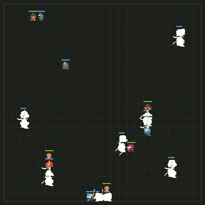
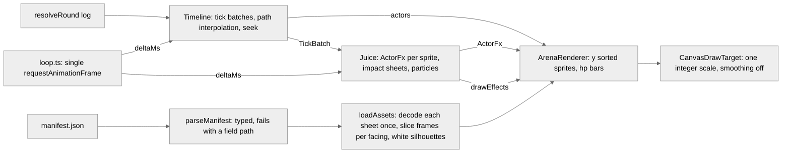

# servpit

[](https://github.com/iam25th1/servpit/actions/workflows/ci.yml)

Slot reel battle royale. One pure function, `resolveRound(seed, entrants, config)`, spins three reels per entrant, runs the fight, and pays the pot, emitting a replayable event log. The client rendering core plays that log back on a fixed camera canvas with sprite local impact feedback. No chain, no agents yet.



## Quick start

```bash
npm ci --ignore-scripts
npm run dev                     # then open http://localhost:3000/arena?seed=demo&entrants=24
npm run sim                     # 1000 headless rounds with a report
npm run sim -- --rounds 5000 --entrants 32 --seed night --tier high
npm run gate                    # typecheck, lint, test, build (what CI runs)
npm run reel-report             # rarity distribution over 100,000 reel pulls
npm run extract-assets          # rebuild public/assets from ninja-adventure.zip at the repo root
```

Node 24 or newer. The lockfile is committed and CI installs with `npm ci --ignore-scripts`.

## Round pipeline

```mermaid
%%{init: {"theme": "neutral"}}%%
flowchart LR
    IN[seed + entrants + config] --> V[validate every input]
    V --> RNG[createRng seed]
    RNG --> REELS[3 reels per entrant]
    REELS --> CHARS[combatants: base stats x modifier x stat roll x combo]
    CHARS --> MODE[config.mode.simulate]
    MODE --> LOG[event log + placements]
    LOG --> CHECK1[validate log and placements]
    CHECK1 --> POT[pot = stake x entrants, rake in bps]
    POT --> DIST[config.mode.distribute prize]
    DIST --> CHECK2[assert payouts cover everyone and sum to pot - rake]
    CHECK2 --> OUT[reels, characters, log, placements, payouts, pot, rake]
```



Everything downstream of `createRng` draws from one seeded stream in a fixed order, so the same seed, entrants and config always produce the same result, byte for byte, in any process.

## Guarantees

- **Deterministic.** sfc32 seeded from the seed string. `src/engine` may not touch `Math.random`, `Date.now`, `performance.now` or `new Date`. An ESLint block and a source scan test both enforce it.
- **Integer only.** Stats use exact integer percent math (`idiv`, `applyPct`). Money uses BigInt products and integer minor units. Nothing a result depends on passes through a float.
- **Hostile inputs.** Seed, entrants, config and everything the mode strategy returns are read exactly once into plain copies, then validated before use. Getters, proxies and extra fields never reach the result. Bad shape, bad range, duplicate or prototype polluting ids, a function hidden in config, a mode that misreports placements or breaks conservation: the round throws instead of paying.
- **Conservation.** Payouts must cover every entrant exactly once and sum exactly to `pot - rake`. The sim harness re-checks this per round and exits non zero on any miss.
- **Renderer needs nothing else.** Spawn and move events carry tile positions, hit and storm events carry remaining hp, every event carries facing.

## Configuration surfaces

| File | Holds | Notes |
| --- | --- | --- |
| `src/config/roster.ts` | the 16 locked characters and their tiers | data array; the extraction script and the engine both iterate it |
| `src/config/reels.ts` | tier weights, modifier tables, stat roll ranges, combo bonuses | all integers; `validateReelConfig` fails closed |
| `src/config/round.ts` | base stats per tier, arena, storm, damage variance, mode, stake tiers, rake | `mode` is a strategy object |

### Reels

All three reels spin the same 16 face strip. Each tier owns its configured share of the strip (70 / 25 / 5) split evenly among its members as integer weights.

| Reel | Face decides |
| --- | --- |
| 1 | the character (and its tier's base stats) |
| 2 | an ability modifier from the face's tier table |
| 3 | a stat roll percent from the face's tier range |

A pull is fully determined by its three faces, so a replay rebuilds it from the symbols alone.

<details>
<summary>Combination table and reference distribution</summary>

| Combination | Meaning | Bonus to all stats | Share of pulls (100,000 pull run) |
| --- | --- | --- | --- |
| none | three different faces | 0% | 78.8% |
| pair | two matching faces | +10% | 20.6% |
| threeOfAKind | three matching faces | +60% | 0.6% |

Reference sim (`npm run sim`, seed `sim`, 1000 rounds x 24 entrants, after the phase 2 rebalance): baseline win rate 4.17%, pair 4.99%, three of a kind 32.05%. Rare tier characters win 10.5 to 14.6% of their appearances (about 2.9x baseline), uncommon 4.0 to 5.5% (1.16x), common 2.8 to 3.7% (0.80x). `src/config/round.test.ts` locks those bands.

Rare three of a kind (three of the same monster) has probability 3 x (5% / 3)^3, about 1.4 per 100,000 pulls. Treat it as a jackpot, not a tuning target.

</details>

### Modes

A mode is a strategy object (`src/engine/modes/types.ts`): `id`, entrant bounds, `simulate(ctx)` and `distribute(prize, placements)`. Battle Royale (16 to 32 entrants, last one standing takes everything) is the only mode in phase 1. A second mode is a new file next to `battleRoyale.ts` pointed at by `config.mode`; the resolver does not change.

### Stakes and rake

`stakeTiers` maps tier names to a stake in integer minor units (`low: 100`, `high: 1000` by default) and `stakeTier` picks one per round. `rakeBps` is the house take in basis points, `0` by default. `rake = floor(pot * rakeBps / 10000)` computed with BigInt.

## Event log

<details>
<summary>Event type reference and facing encoding</summary>

Every event has the shape `{ t, type, actor, target, value, facing }` plus the optional fields listed below. `t` is the tick; events sharing a tick are ordered by array position. `actor` is always the sprite the event animates.

| type | actor | target | value | extra fields | when |
| --- | --- | --- | --- | --- | --- |
| `spawn` | entrant | `null` | max hp | `x`, `y` | tick 0, once per entrant, in turn order |
| `move` | entrant | `null` | `1` | `x`, `y` (tile after the step) | one event per tile stepped |
| `attack` | attacker | victim | attacker atk stat | | attacker is adjacent (Manhattan distance 1) |
| `hit` | victim | attacker | damage dealt | `hp` (remaining, floored at 0) | immediately after the matching `attack` |
| `death` | victim | killer or `null` (storm) | `0` | | hp reached 0 |
| `storm` | victim | `null` | damage dealt | `hp` (remaining, floored at 0) | after `maxTicks`, escalating each tick, spares the last survivor |
| `win` | winner | `null` | `0` | | final event of every log |

**Facing** is required on every event and is one of four integers matching the four column sprite sheets:

| value | direction |
| --- | --- |
| `0` | down |
| `1` | up |
| `2` | left |
| `3` | right |

`y` grows downward as on screen. A `move` faces the direction stepped. An `attack` faces the victim. `hit`, `death` and `storm` carry the victim's current facing. `spawn` faces down. Ties between axes resolve horizontal.

The arena is a `width x height` tile grid (24 x 24 by default); positions are integer tile coordinates, `0 <= x < width`, `0 <= y < height`. The renderer should not compute anything: hp bars come from `spawn.value` and `hit.hp` / `storm.hp`, positions from `spawn` and `move`.

</details>

## Rendering

Open `/arena?seed=<seed>&entrants=<16 to 32>`. The page resolves the round in the browser (demo only; production resolves on the server and ships the log), loads the sprites, and plays the log back. Replay restarts without a reload; the scrubber seeks; speed is 0.5x, 1x or 2x. With `prefers-reduced-motion` set, playback starts paused.



**Vestibular safety.** The camera never moves: the logical picture is the whole arena plus padding, drawn at one integer scale, and `DrawTarget` exposes no translate, zoom, rotate or blur. Every impact effect is sprite local (white flash, offset, scale about the sprite's own centre) or a point effect (impact sheet, particles). Hitstop freezes actors only, never the effects, and only on deaths and the final blow.

<details>
<summary>Timeline tick model</summary>

Tick 0 (spawns) applies at time 0. For T >= 1, tick T owns the window `[(T - 1) * tickMs, T * tickMs)`. During the window each actor walks its tick T move path (up to three tiles) with linear easing, faces each step's direction and reports `moving` so the walk animation plays. When the window ends the whole tick T batch is applied at once and listeners get one `TickBatch`, so the 47 events that can share a tick stay together. `durationMs = lastTick * tickMs`; the default 200 ms tick plays a 37 tick round in about 7.5 s.

`seek(ms)` rebuilds from tick 0 with `silent = true` so effects do not replay; `restart()` seeks to 0 and plays. The page calls `Juice.reset()` around both.

</details>

<details>
<summary>Juice parameters and defaults (src/render/juice.ts, DEFAULT_JUICE)</summary>

| Parameter | Default | Effect |
| --- | --- | --- |
| `hitstopFrames.death` | 3 | render frames actors freeze on a death event |
| `hitstopFrames.finalBlow` | 5 | frames actors freeze on the batch that carries `win` |
| hitstop cap | 1 per tick | the batch takes the max of its triggers, never the sum; ordinary hits never freeze |
| `flashFrames` | 2 | victim drawn as a white silhouette |
| `knockbackPx` | 3 | victim offset directly away from the attacker on the contact frame |
| `knockbackFrames` | 4 | frames the offset eases back to 0 |
| `punchScale` | 1.15 | attacker sprite local scale on the contact frame |
| `punchFrames` | 5 | frames the punch settles to 1 |
| `attackPoseFrames` | 6 | frames the attacker holds the attack pose |
| `deadFadeFrames` / `corpseAlpha` | 40 / 0.35 | corpse fades from 1 to 0.35 |
| `sheetFrameMs` | 50 | FX sheet frame duration (a 4 frame sheet lasts one tick) |
| `impactByTier.common` | Cut, 1x, sparks 1 | impact sheet at the midpoint between attacker and victim |
| `impactByTier.uncommon` | CutDouble, 1.15x, sparks 2 | |
| `impactByTier.rare` | CircularSlash, 1.5x, sparks 3 | |
| `deathSheet` | Smoke | on the victim, plus smoke particles |
| `killSheet` | Explosion | at the midpoint for the killing blow |
| win | confetti 2, coins 2 | on the winner |

Impact FX spawn at the midpoint between the two sprite centres, not on either sprite. Particles come from one emitter (`src/render/emitter.ts`); coins, sparks, smoke and confetti are configs of it, and it is advanced by the same loop delta as everything else. FX/Slash is not used: its frame width does not equal its height.

</details>

## Assets

The locked roster is extracted from the Ninja Adventure pack into `public/assets/<CharacterId>/` with a `manifest.json` describing every sheet. Run `npm run extract-assets` with `ninja-adventure.zip` at the repo root (the zip is gitignored). The script reads real PNG dimensions and records anything unexpected under `warnings` instead of guessing.

<details>
<summary>Manifest shape</summary>

```json
{
  "source": "ninja-adventure.zip",
  "pack": "Ninja Adventure - Asset Pack",
  "frame": { "width": 16, "height": 16 },
  "faceset": { "width": 38, "height": 38 },
  "facingOrder": ["down", "up", "left", "right"],
  "fx": [
    { "id": "Cut", "group": "attack", "source": "FX/Attack/Cut/SpriteSheet.png", "path": "/assets/fx/Cut.png", "frameWidth": 32, "frameHeight": 32, "cols": 4, "rows": 1 },
    { "id": "Explosion", "group": "explosion", "source": "FX/Elemental/Explosion/SpriteSheet.png", "path": "/assets/fx/Explosion.png", "frameWidth": 40, "frameHeight": 40, "cols": 9, "rows": 1 }
  ],
  "entries": [
    {
      "id": "Knight",
      "tier": "common",
      "sourceFolder": "Actor/Character/Knight",
      "facesetPath": "/assets/Knight/Faceset.png",
      "sprites": {
        "idle":   { "path": "/assets/Knight/Idle.png",   "frameWidth": 16, "frameHeight": 16, "cols": 4, "rows": 1, "facingColumns": [0, 1, 2, 3] },
        "walk":   { "path": "/assets/Knight/Walk.png",   "frameWidth": 16, "frameHeight": 16, "cols": 4, "rows": 4, "facingColumns": [0, 1, 2, 3] },
        "attack": { "path": "/assets/Knight/Attack.png", "frameWidth": 16, "frameHeight": 16, "cols": 4, "rows": 1, "facingColumns": [0, 1, 2, 3] },
        "dead":   { "path": "/assets/Knight/Dead.png",   "frameWidth": 16, "frameHeight": 16, "cols": 1, "rows": 1, "facingColumns": [0, 0, 0, 0] }
      }
    },
    {
      "id": "Bear",
      "tier": "rare",
      "sourceFolder": "Actor/Monster/Bear",
      "facesetPath": "/assets/Bear/Faceset.png",
      "sprites": {
        "sheet": { "path": "/assets/Bear/SpriteSheet.png", "frameWidth": 16, "frameHeight": 16, "cols": 4, "rows": 4, "facingColumns": [0, 2, 1, 3] }
      }
    },
    {
      "id": "Dragon",
      "tier": "rare",
      "sourceFolder": "Actor/Monster/Dragon",
      "facesetPath": "/assets/Dragon/Faceset.png",
      "sprites": {
        "sheet": {
          "path": "/assets/Dragon/SpriteSheet.png", "frameWidth": 16, "frameHeight": 16, "cols": 4, "rows": 4,
          "facingColumns": null,
          "frameRects": {
            "down":  [{ "x": 0,  "y": 0, "w": 16, "h": 16 }, { "x": 0,  "y": 16, "w": 16, "h": 16 }, { "x": 0,  "y": 32, "w": 16, "h": 16 }, { "x": 0,  "y": 48, "w": 16, "h": 16 }],
            "up":    [{ "x": 16, "y": 0, "w": 16, "h": 16 }, { "x": 16, "y": 16, "w": 16, "h": 16 }, { "x": 16, "y": 32, "w": 16, "h": 16 }, { "x": 16, "y": 48, "w": 16, "h": 16 }],
            "left":  [{ "x": 32, "y": 0, "w": 16, "h": 16 }, { "x": 32, "y": 16, "w": 16, "h": 16 }, { "x": 32, "y": 32, "w": 16, "h": 16 }, { "x": 32, "y": 48, "w": 16, "h": 16 }],
            "right": [{ "x": 48, "y": 0, "w": 16, "h": 16 }, { "x": 48, "y": 16, "w": 16, "h": 16 }, { "x": 48, "y": 32, "w": 16, "h": 16 }, { "x": 48, "y": 48, "w": 16, "h": 16 }]
          }
        }
      }
    }
  ],
  "warnings": [
    "NinjaFire: SeparateAnim/Idle.png missing in pack, animation omitted",
    "NinjaWater: SeparateAnim/Idle.png missing in pack, animation omitted",
    "Dragon: facingColumns is null on purpose, frames come from the hand sliced frameRects list. A pixel check shows columns 2 and 3 are mirror image 16 px frames (left, right) whose wings meet at the cell boundary, not one 32 px frame as phase 1 first recorded"
  ]
}
```

Characters (common and uncommon) have `idle`, `walk`, `attack`, `dead` sheets of 16 x 16 frames. Monsters (rare) have one `sheet` of 4 x 4 frames. Facesets are 38 x 38.

`facingColumns` maps each facing value (index 0 down, 1 up, 2 left, 3 right, the same encoding as the event log) to the sheet column holding that direction, or is `null` when `frameRects` carries an explicit hand sliced list per facing. A single column sheet (`Dead.png`) records `[0, 0, 0, 0]`. The loader (`src/render/assets.ts`) indexes through these rather than assuming column equals facing, because the pack is not consistent. Verified on nearest neighbour upscales and a pixel alpha check of the extracted sheets:

| Sheets | Column order in the pack | Manifest |
| --- | --- | --- |
| every character sheet, Cyclope | down, up, left, right | `facingColumns [0, 1, 2, 3]` |
| Bear | down, left, up, right | `facingColumns [0, 2, 1, 3]` |
| Dragon | down, up, left, right, but columns 2 and 3 are mirror images whose wings touch at the cell boundary | `facingColumns null`, `frameRects` with four 16 x 16 frames per facing |

The `fx` section lists the FX strips the renderer uses: one row of square frames, frame size equal to the sheet height (`FX/Attack` 32 px, `FX/Smoke` 32 px, `FX/Elemental/Explosion` 40 px). `FX/Slash` is deliberately absent.

Pack quirks are handled explicitly by the loader and recorded in `ActorSprites.notes`: `NinjaFire` and `NinjaWater` ship no `Idle.png`, so walk frame 0 is their idle pose; monsters have one sheet, so idle and attack use walk frame 0 and there is no dead pose (the renderer fades the corpse); the monster sheet filename varies, so the extraction script globs for the single non Faceset png. A missing or mis sized sheet, or a frame rect outside its sheet, throws an `AssetError` naming the actor, animation and path at load time. Nothing renders as a blank square.

</details>

## Layout

```
src/config/        roster, reels, round (all data)
src/engine/        rng, intmath, reels, combat, events, payout, resolveRound, modes/
src/render/        manifest, assets, draw, timeline, arena, emitter, juice, loop (client rendering core)
src/app/arena/     the /arena demo page
scripts/           sim.ts (npm run sim), extract-assets.ts, reel-distribution.ts, lib/
public/assets/     extracted roster sprites, fx strips + manifest.json (committed)
docs/media/        captured arena clip
test/              repo policy tests (gitignore rules, em dash ban)
.github/workflows  ci.yml: npm ci --ignore-scripts, typecheck, lint, test, build
```

## Phase 2 notes

- AgentKit (`@coinbase/agentkit`) pulls Node only dependencies. Any route touching it must run on the Node runtime, never Edge, and will likely need `serverExternalPackages` in `next.config.ts`.
- It pins `zod ^3`. Keep engine validation dependency free (as it is now) so no schema library sits on the payout boundary.
- The resolver is framework free and can move into a worker or API route unchanged. The /arena page resolves in the browser for demo convenience only; the render core takes any `{ log, characters }` and never touches money.

## Credits

Character and monster art: Ninja Adventure asset pack by Pixel-Boy and AAA, CC0 1.0.
