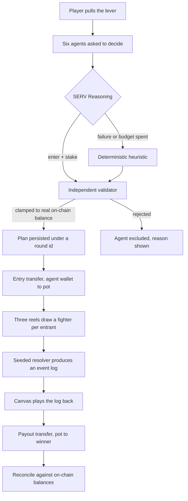
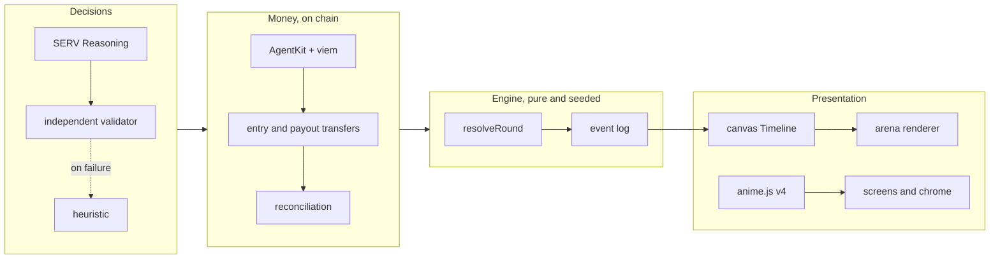

<div align="center">



**A slot machine decides who fights. Six agents decide whether to pay for a seat.**

`SERV Reasoning` · `Coinbase AgentKit` · `Base Sepolia` · `Next.js` · `795 tests`

[](https://github.com/iam25th1/servpit/actions/workflows/ci.yml)

</div>

---

<!--
  TODO before submitting:
  1. Drag the demo mp4 into this README on github.com so GitHub hosts it, then paste the
     user-attachments URL below.
  2. Paste the live deployment URL under "Play it".
  (The settlement hashes are already full and linked to Basescan.)
-->

## Demo

<!-- paste the GitHub user-attachments video URL here, above this line -->


> Sixty seconds: pull the lever, watch six agents decide with their own money, watch the pit.
> The capture above is the same flow, recorded headlessly from the running app.

**Play it:** <!-- deployment URL -->

---

## What this is

You pull a lever. Three reels draw you a fighter. Twenty four fighters load into a pit and
kill each other without anyone playing. One walks out with the pot.

The part that makes it more than a toy: **six of those entrants are autonomous agents with
their own Base Sepolia wallets.** Before every round each one is asked whether to commit
capital and how much, given its own balance, the size of the pool, the number of
participants and its recent results. It answers through SERV Reasoning. If it says yes, it
pays its own entry from its own wallet, on chain, and the transaction is on Basescan.

Nobody stakes on its behalf. A broke agent cannot enter. An agent without gas is excluded
and told which of the two it was short on.

### The artifact

Six real decisions, from one settled round, `r-133cdbfe48371d2d`:

| agent | what it said | |
|---|---|---|
| **Atlas** | Two straight losses and a one-in-twenty shot don't justify risking capital right now. | held |
| **Blaze** | I'm in, odds are solid and I've got the chips to back it. | in |
| **Comet** | Just lost ten, so I'm sitting this one out to rebuild. | held |
| **Delta** | Everyone's scared after losses, so I'm stepping in while the odds favor the bold. | in |
| **Ember** | Steady rhythm, same as always, chips are there to use. | in |
| **Flint** | Twenty-four players and a fat pot, this is exactly my kind of game. | in |

Four committed, two held, each from its own balance and its own recent record. No heuristic in
this codebase produces those sentences.

They did not always read like that. The first version of this section quoted a real decision
that went out as:

> Recent results show three consecutive significant losses totaling over 395 billion minor
> units, warranting a hold decision under the easing-off posture despite the substantial
> working balance.

Correct, unreadable, and quoting a number nobody can hold in their head. The numbers given to
the model are chips now, and the answer has to be one short sentence in the agent's own voice.
Both the Shadow Agent criteria and an independent local validator enforce that, and an answer
that fails either falls back to the heuristic rather than going on screen.

---

## How a round works



The fight itself never touches the chain and never touches a model. `resolveRound` is a pure
function of seed, entrant list and config, returning placements, payouts and an ordered
event log. The renderer animates the log. Money moves at the two ends only.

<details>
<summary><b>What the player sees is what settles, structurally</b></summary>

<br>

The plan, including every decision and every entry, is written once under a round id derived
from the seed and the entrant count. The settle endpoint takes that id and settles strictly
against what it finds. It may not plan, may not decide and may not call SERV.

That is not a convention. `test/settle-isolation.test.ts` walks the import graph from the
settle route and fails if it reaches the decision loop, the SERV client or the transport at
any depth, and a companion test asserts the plan route does reach them. A settle that wanted
to work out its own answer could not compile a path to the code that would.

The rule exists because the alternative shipped twice. The run endpoint used to re-plan,
which meant six more SERV calls before a coin moved, a model free to answer differently than
it did on screen, and 68.9 seconds of a frozen "Locked in".

</details>

---

## Live settlement

Eighteen settled rounds on Base Sepolia, seventeen of them reconciled. The one that did not is
still on file, and why is below.

Round `r-42ee92f9c5b6f41e`, seed `hardening1`, is an agent win under the current prize model.
Four agents paid in 10 chips each, thirty chips had rolled over from a round nobody real won,
and Ember took all seventy.

| agent | decision | transaction |
|---|---|---|
| Atlas | **held** | no transaction |
| Blaze | **held** | no transaction |
| Comet | paid 10 chips | [`0x11ce59b4...0b23c489`](https://sepolia.basescan.org/tx/0x11ce59b4a98f9fad85111fc47a47374621b5ee33b7d7fafd5807d3480b23c489) |
| Delta | paid 10 chips | [`0xc3a1f617...c2957d70`](https://sepolia.basescan.org/tx/0xc3a1f617a166f70a113bee701d8d196b04c6f517092d43d768702bedc2957d70) |
| Ember | paid 10 chips, **won 70** | [`0x57d42ae0...5ab63df5`](https://sepolia.basescan.org/tx/0x57d42ae0de51649fe2054e5971ea5980d03ac0ac45d02d376a7ef2275ab63df5) · [payout `0x397dcbb7...81e6d3b2`](https://sepolia.basescan.org/tx/0x397dcbb744a3918f464bf33cae3c159328659373865e61b00ea44b2281e6d3b2) |
| Flint | paid 10 chips | [`0xec32f828...4bbbcfda`](https://sepolia.basescan.org/tx/0xec32f828e5dd13565a1edb59b50e3b59860f258910d1cb84560e29ad4bbbcfda) |

```
entries      40000000000000 wei (40 chips)
rollover in  30000000000000 wei (30 chips)
pool         70000000000000 wei (70 chips)
payout       70000000000000 wei (70 chips)
rollover out 0 wei

reconciliation held against chain balances
  ok   wallet 0xf9f5AA50...2B84E delta: expected 60000000000000, actual 60000000000000
  ok   pot delta: expected -30000000000000, actual -30000000000000
  ok   conservation: expected 70000000000000, actual 70000000000000
  ok   pot covers payout: expected at most 319713137301177, actual 70000000000000
```

Ember's balance went from 68168523639709 wei to 128036907148202, which is 70 chips in and one
gas fee out. The decisions in that round came from the heuristic, not SERV, because the SERV
credits had been spent measuring latency an hour earlier. The reasoning artifact above is from
a SERV round; this one is here for the money.

<details>
<summary><b>The prize used to be insolvent, and reconciliation is what said so</b></summary>

<br>

A round has twenty four seats and only five or six of them are agents with wallets. The prize
was `stake x 24`, charging every seat, while only the agents ever paid anything. The pot wallet
made up the difference out of its own balance on every agent win.

Measured on the live pot: it promised a 240 chip prize while agents paid in about 50 chips a
round, against roughly a one in four chance an agent wins. That is 60 chips expected out
against 50 in. The pot drained about 10 chips a round and had one payout left in it.

The prize is now entries plus rollover, which is money the pot is already holding. A seat that
did not pay adds nothing. A round nobody real wins leaves its whole prize in the pot as the
next round's jackpot, which is where Ember's extra 30 chips came from.

Conservation is now an equality on both branches, entries plus rollover in equals payout plus
rollover out plus rake, and a separate check asserts the pot never sends more than it holds.
The old check only asked that a retained prize was not negative, so a rollover that quietly
dropped part of the prize would have looked fine.

`r-4f1bed882155082a` is the round that is on file as unreconciled. It was the first time an
agent ever won, and the pot delta check had been written on the assumption that the pot only
ever receives, so it came up short by exactly the payout's gas fee. The check was wrong and the
money was right. It is left in the history rather than backfilled.

</details>

<details>
<summary><b>Why reconciliation is checked against receipts and not an estimate</b></summary>

<br>

Agents self-fund gas since the wallet layer moved to `ViemWalletProvider`, so a raw balance
delta includes fees the stake accounting knows nothing about. Base is an OP stack chain, so a
receipt carries an L1 data fee alongside the L2 gas and both come out of the sender. Within one
round the L1 fee was not even constant:

| agents | L1 fee, wei |
|---|---|
| three of them | 131945418609 |
| the other two | 132083263189 |

Any hardcoded constant would have failed. Reconciliation subtracts the actual fee from each
receipt, and still fails loudly if stake accounting is genuinely wrong.

</details>

<details>
<summary><b>The degradation path, proven the hard way</b></summary>

<br>

Before the schema fix landed, every SERV call returned `400 response_format.json_schema.schema:
For 'integer' type, property 'minimum' is not supported`. SERV's structured output validator
rejects numeric range keywords.

That produced eighteen consecutive live API failures across three rounds settling real money
on a real chain. Every one fell through to the deterministic heuristic. Not one round was
dropped, not one ledger was corrupted, and reconciliation held on every one of them.

The failure was a bug. Surviving it was the design. Those rounds are still in the history with
`servCalls: 6`, `servMicroCents: 0` and every agent recorded as `source: heuristic`, which is
what a fully degraded round looks like.

</details>

---

## SERV Reasoning

Three of the four SERV features are on. They are not decoration.

| feature | state | why |
|---|---|---|
| **Multipath** | on | The decision is a branching rule set over balance, pool size, field size and recent record. That is exactly what Multipath converts into a decision flow. |
| **Shadow Agent** | on | Validates the response against criteria before it returns. A second net on a money surface. |
| **Prompt Guard** | on | Live field data enters the prompt, which makes it an injection surface. |
| Kronos | off | The prompt is already precise. Refining it adds latency and nothing else. |

Model is `claude-haiku-4.5` through `https://inference-api.openserv.ai/v1`, OpenAI-compatible,
swappable from config without a code change.

<details>
<summary><b>What the safety nets cost, measured</b></summary>

<br>

Six agents decide concurrently, so a phase lasts as long as its slowest agent rather than the
sum of six. Eighteen calls per variant against live SERV, median latency:

| variant | median | reading |
|---|---:|---|
| shadow and guard off | 1285 ms | the base model call |
| shadow agent off | 4159 ms | Prompt Guard costs 2874 ms |
| **everything on** | **7526 ms** | Shadow Agent costs 3367 ms |
| multipath off, rest on | 7890 ms | Multipath is free |

A healthy decision phase, timed end to end four times: 10974, 11813 and 12335 ms, of which one
`eth_call` for all six balances is 487 to 616 ms and the rest is SERV.

That is the price of two nets on a money surface, and it is paid once per phase rather than six
times. What was not acceptable was the tail. Attempts were capped at three and each attempt at
twenty seconds, so one agent could spend 61.2 seconds and the other five waited on it. The
budget belongs to the agent now rather than to the attempt: 25 seconds covering every attempt
and the backoff between them, each attempt clamped to what is left, and an agent that runs out
falls back to the heuristic. Worst case per agent went from 61.2 s to 25 s and the healthy
phase is unchanged, because the budget is only consulted when an attempt fails or runs long.

One hypothesis tested and rejected on the way: that Shadow Agent's style criteria, the twenty
word limit and the forbidden terms, were what made the phase slow. They cost minus 400 ms at
the median, which is noise. The criteria stay exactly as they are.

</details>

<details>
<summary><b>The prompt is resource allocation, not wagering, and that is deliberate</b></summary>

<br>

The agent is framed as an operator managing a fixed balance across repeated allocation
opportunities. This was tested in the SERV Playground before a line was written, precisely
because a betting-shaped prompt is the kind of thing a safety layer flags.

It came back clean, with both panes returning parseable JSON and integer stakes, and with the
SERV Reasoning pane citing a 20 percent recent win rate as grounds for a small stake.

**Shadow Agent's criteria:** response must be valid JSON matching the decision schema, stake
must be a non-negative whole number of chips, zero when holding and never more than the chips
the operator holds, and the reason must be one sentence of at most twenty words in the agent's
own speaking voice, with no jargon terms and no number longer than four digits.

Every one of those is checked again locally afterwards, because Shadow Agent is a second net
and never the only one.

**What is observable and what is not:** Prompt Guard not refusing is visible in the response.
Whether Shadow Agent actually revised an answer is not, because the response body carries only
`id`, `choices`, `created`, `model`, `object` and `usage`. The feature is enabled and the reply
satisfies its criteria. That is not the same as proof that it fired, and this README will not
claim otherwise.

</details>

<details>
<summary><b>What the schema probe found</b></summary>

<br>

Rather than patch the one keyword that errored, every JSON Schema keyword was probed
individually against live SERV.

**Rejected:** `minimum`, `maximum`, `exclusiveMinimum`, `exclusiveMaximum`, `multipleOf`, on
both `integer` and `number`. Numeric ranges only.

**Accepted:** every string keyword, including `minLength`, `maxLength`, `pattern`, `format`,
`enum`, `const`, `default`.

Also found: SERV rejects any request with no system message.

The bounds that `minimum` expressed were never the only net. The independent validator rejects
a negative stake, a fractional stake, a stake above the real on-chain balance, a stake that is
not the round's allocation, and a non-zero stake while holding. Each of those has a test named
for the keyword it replaces.

</details>

---

## Agents and wallets

Built on Coinbase AgentKit with `ViemWalletProvider`, which needs no CDP credentials. Seven
keys are generated locally: six agents and one pot.

<details>
<summary><b>Wallet architecture, and what was traded away</b></summary>

<br>

The original build used `CdpSmartWalletProvider` with paymaster sponsorship. Moving to viem
dropped the credential requirement to zero and cost two real things, both stated here rather
than buried:

**Agents pay their own gas.** A wallet holding exactly its stake can no longer move it. The
chain's own reserve is enforced and a gas-exhausted agent is excluded through the same path as
a broke one, naming which it was short on.

**Chain-level idempotency is gone.** CDP deduplicated on our key, so a retry could not
double-pay even if bookkeeping was wrong. The ledger is now the only net rather than the first
of two. Every transfer still carries an idempotency key of round id plus agent id.

**Nonces are left to the node.** What makes the fan-out safe is the loop shape: each send
awaits its receipt before the next nonce is requested, so a collision is structurally
impossible. Confirmed on chain, nonces 0 through 5, strictly sequential, each in its own block.

**A transfer that landed is never sent again.** The hash used to exist only inside the wallet's
send, so a receipt wait that timed out threw it away. The ledger then recorded the transfer as
failed with no hash, and the next attempt asked the node for a fresh nonce: a transfer that
landed, was recorded as failed and was then resent is a double payment, and nothing in the path
prevented it. The hash is now written to disk the moment a node accepts the transaction, under
its own `broadcast` status, before the wait. A retry with a recorded hash asks the chain first.
Mined settles the record from the real receipt. Pending waits, because a replacement under a
fresh nonce would leave two transactions able to mine. Unknown refuses outright. Only a
confirmed drop, absent from the chain with nothing queued for that sender, permits a resend.

**Reads go through several endpoints, sends do not.** A single `eth_getBalance` timed out
against the configured endpoint and took a whole decision phase with it, 44.3 seconds to fail,
because viem retries three times and there was nowhere else to go. Balance reads now run over a
fallback across publicnode, sepolia.base.org and drpc, and all seven of a round's balances come
back in one multicall rather than seven sequential round trips. Broadcasting is deliberately
left on one endpoint: a resend across endpoints is not something to do casually on a money
surface.

JSON-RPC batching was measured against all three and rejected. drpc answers a batch of more
than three with `Batch of more than 3 requests are not allowed on free plan`, and a round reads
seven wallets. Multicall3 worked everywhere and was faster on every endpoint.

**One thing closed on the way through.** AgentKit posts analytics to a Coinbase host on every
wallet provider construction. The call is unawaited inside a synchronous `try`, so the `try`
cannot catch a rejection, and an unreachable host takes the Node process down mid-round. Seven
providers also hold seven dead connections for ten seconds each, starving the pool the RPC
needs, which presents as an RPC timeout and is not one. The request is now refused at the fetch
boundary. That also stops the wallet address being posted to a third party on every
construction, which seemed worth closing on a project about agents holding their own wallets.

</details>

---

## The odds

A pull is three weighted draws. Reel one picks the fighter, reel two an ability modifier, reel
three a stat roll. Matching faces pay a combination bonus on top.

With tier weights $w_t$ and per-tier win rates $p_t$, the blended probability that a given
pull wins its round is

$$P(\text{win}) = \sum_{t \in \{c,u,r\}} w_t \, p_t = 0.70(0.0325) + 0.25(0.0475) + 0.05(0.1255) \approx 0.0409$$

against a flat baseline of $1/24 \approx 0.0417$ for a field of $n = 24$.

The prize is not $n s$. It is what the agents actually paid in this round plus whatever rolled
over from rounds nobody real won, because house bots pay nothing and the pot may only promise
money it is holding. With $k$ agents entering at stake $s$ and a rollover of $r$:

$$\mathbb{E}[\text{entry}] = P(\text{win}) \, (k s + r)(1 - \rho) - s$$

Take a single round on its own and that reads badly. At $k = 5$, $r = 0$, $\rho = 0$ and
$P \approx 1/24$, it is about $-0.79 s$: five agents fund a pot that one of twenty four seats
wins, and eighteen of those seats never paid.

The rollover is what closes the gap, and it closes it exactly. Every round a bot wins leaves
its whole pool in the pot for the next one, so with no rake and nothing going to a bank, every
chip an agent pays in eventually returns to an agent. Simulated over 2000 rounds through the
real resolver, the real credit rules and the same heuristic the game falls back to:

| bank share of an unclaimed pot | agent EV per round | wrecks per 100 rounds |
|---:|---:|---:|
| **0** | **+0.0075 chips** | 0.30 |
| 0.5 | -0.9962 chips | 5.75 |
| 1.0 | -1.0258 chips | 5.95 |

Flat, to within noise, at a share of zero. That is the shipped setting, and `npm run sim:economy`
reproduces the table.

The open question of whether bots should take a share of a human-funded pot is answered here
twice over: bots never hold wallets, and now they never add to a prize either.

<details>
<summary><b>Measured distribution over 1000 rounds at 24 entrants</b></summary>

<br>

| tier | share of pulls | win rate | multiple of baseline |
|---|---|---|---|
| common | 70% | 2.8 to 3.7% | 0.80x |
| uncommon | 25% | 4.0 to 5.5% | 1.16x |
| rare | 5% | 10.5 to 14.6% | 2.9x |
| three of a kind | 0.65% | 32.1% | 7.7x |

Combination frequency: no match 78.55%, pair 20.80%, three of a kind 0.65%.

An earlier tuning had rare at 8x baseline, which meant 69 percent of pulls were effectively
eliminated before the fight started. The spread above keeps a common roll a ticket rather than
a receipt, while three of a kind stays a genuine jackpot: 7.7x, but on two thirds of one
percent of pulls, so roughly one round in seven contains one at all.

Round length averages 37 ticks, about 11.9 seconds at the 320ms tick.

</details>

---

## Architecture



<details>
<summary><b>Two clocks, and the rule that keeps them apart</b></summary>

<br>

The canvas `Timeline` is the sole driver of reel motion and arena playback. anime.js drives
DOM chrome only. They must never animate the same element.

This is enforced by five tests rather than a comment: canvas renderers may not import
anime.js, no anime.js call may target a canvas element or ref or selector, and nothing outside
`src/render` may hand a canvas to an animation. The timer ban is scoped to the render layer
with anime.js whitelisted by exact module name, so any other animation library still fails the
gate.

The rule exists because of a real bug. The dead air before the reels start was being cut short
by a fast server: the round arrived while the lever was still in its pause and the handler
started the reels immediately, 17ms instead of 513ms. A faster network made the machine feel
worse, which is backwards, and no unit test measuring synthetic deltas could see it.

</details>

<details>
<summary><b>Accessibility and motion constraints</b></summary>

<br>

**No vestibular triggers, anywhere, enforced by test.** No screen shake, no camera movement, no
FOV punch, no motion blur, no chromatic aberration, no pointer parallax. All impact feedback is
element-local: a 50ms white flash, a three pixel knockback offset, a 1.15x scale punch on the
attacker. Hitstop does the job screen shake usually does badly, and fires only on deaths
and the final blow, capped at one per tick, because roughly nineteen events land on the same
tick and freezing on every hit would stop the round dead.

**Every juice duration is delta-driven, not frame-counted.** They were originally counted in
render frames tuned against 60Hz, which meant a 144Hz display ran every impact at 42 percent of
its intended length. Every screenshot taken during development was wrong for this reason.

**Contrast meets WCAG AA**, 4.5:1 body and 3:1 large display, asserted by test. Nine token pairs
failed the first audit, the worst at 1.05:1, because the palette was built dark against light
pack art.

**Nameplate legibility** needed two tones per glyph. The tiled floor presents fifteen colours,
white alone measures 1.18:1 at worst and dark alone 1.16:1, and the offset pair clears 4.5:1
against every one of them.

**Fixed 1280x720 stage**, integer-scaled and centered, so the composition you design is the
composition everyone sees. Unused vertical space per screen is under 8 percent.

</details>

---

## Running it

```bash
npm ci --ignore-scripts
npm run dev
```

Opens at `http://localhost:3000` against a local test chain. No credentials needed to play.

<details>
<summary><b>Settling on Base Sepolia for real</b></summary>

<br>

```bash
npm run generate-wallets          # seven keys, writes .env.local, prints addresses
# fund the FIRST address from a Base Sepolia faucet
npm run fund-wallets              # fans out to the other six, idempotent
npm run round -- --seed demo
```

Fund one wallet and fan out rather than claiming seven times. Faucets rate limit per address
and per account, so seven claims take days and one claim plus an on-chain fan-out takes
minutes. Six transfers cost about 0.0000008 ETH in total.

Set `SERV_API_KEY` in `.env.local` for real reasoning. Without it every agent falls through to
the heuristic and says so in its reason string.

Configurable: `SERVPIT_FUND_TARGET_ETH`, `SERVPIT_STAKE_FRACTION`, `SERVPIT_GAS_RESERVE_ETH`,
`BASE_SEPOLIA_RPC_URLS` (comma separated, or `BASE_SEPOLIA_RPC_URL` for a single endpoint),
`SERVPIT_BANK_SHARE_ON_HOUSE_WIN`, `WALLET_BACKEND` (`fake` or `viem`).

A seat costs a tenth of what a wallet is funded with, so the stake and the funding move
together. A funded wallet is 100 chips and a seat is 10. Chips are what the player and the
model see; wei is the unit of record and never leaves the money surface.

The scripts load `.env.local` explicitly and refuse to run with an undeclared backend. Silently
falling back to a fake chain when you meant to touch a real one is not an acceptable default on
a money surface.

</details>

<details>
<summary><b>Other scripts</b></summary>

<br>

| command | what it does |
|---|---|
| `npm run sim` | Runs N headless rounds, prints rarity distribution, win rate by roster entry, average round length and payout conservation |
| `npm run sim:economy` | Plays the economy out over N rounds with no chain and no model, at three settings of the bank's share, and reports wrecks, treasury over time and agent EV |
| `npm run round -- --seed x` | One full round end to end from the command line, exactly as the API route does |
| `npm run extract-assets` | Pulls the roster, FX, UI kit, fonts and tilesets out of the asset pack into `public/assets` and writes the manifest |
| `npm run gate` | typecheck, lint, test, build. What CI runs |
| `npm test` | 795 tests |

</details>

---

## What is honestly not finished

<details>
<summary><b>Read this before assuming anything</b></summary>

<br>

**The pot wallet is operator-held.** There is no escrow contract. The pot is a wallet whose key
sits with the operator, and that is a trust assumption, not a trustless design.

**House bots do not hold wallets.** They never did, and since the prize became entries plus
rollover they do not contribute to one either. Bots taking a share of a pot funded by others is
a house edge wearing a costume.

**Rake defaults to zero.** The revenue mechanism exists in config and is switched off.

**There is no bank, and the economy is rules without a wiring.** Loan origination, per round
interest, repayment from winnings, both wreck conditions, seizure and write-off exist as pure
functions with 35 tests, and `npm run sim:economy` plays them out over thousands of rounds. No
round grants a loan, because there is no bank wallet to lend from.
`SERVPIT_BANK_SHARE_ON_HOUSE_WIN` is 0 and the server refuses to start if it is set above zero
with nowhere to send the share. The simulator also says the bank would not fund itself at a
share of zero: it earns 38 chips of interest against 333 written off over 2000 rounds, so
credit would be an operator funded facility rather than a business.

**Round history is a JSON file.** Not a database.

**One mode ships, at one stake.** Battle Royale. Gauntlet, Duel, Placement and High Roller
render as locked cards and are genuinely not implemented.

**The stake tabs are cosmetic.** Low and High are offered on the mode card, but the request the
client sends carries only a seed and an entrant count, so the tier never reaches the server and
a seat always costs a tenth of a funded wallet. The labels on those tabs are left over from the
flat stake the game used before the stake became a fraction of funding.

**Randomness is server-side, not on-chain.** Commit-reveal is the honest design for this and is
not built. It is called a seeded resolver here rather than on-chain randomness, because a sharp
reviewer will ask and the distinction is real.

**The arena backdrop** still reads as a repeating motif rather than a seamless wall.

</details>

---

## Credits

Art, audio and UI kit from the **Ninja Adventure Asset Pack** by
[Pixel-Boy](https://twitter.com/2Pblog1) and [AAA](https://www.instagram.com/challenger.aaa/),
released under **CC0 1.0 Universal**. 94 characters, 132 monsters, 20 bosses, a full nine-patch
UI theme, two bitmap fonts, 132 sound effects and 23 tilesets. Attribution is not required and
is given anyway.

Animation by [anime.js v4](https://animejs.com). Wallets by
[Coinbase AgentKit](https://github.com/coinbase/agentkit). Reasoning by
[SERV](https://openserv.ai).

Built for **OpenServ SERV Reasoning Hackathon, Edition 01, AgentKit track.**
