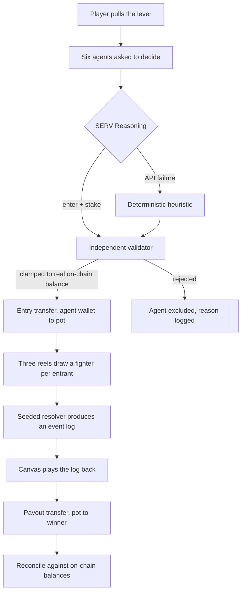
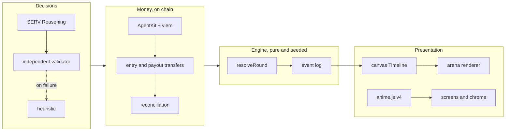

<div align="center">


**A slot machine decides who fights. Six agents decide whether to pay for a seat.**

`SERV Reasoning` · `Coinbase AgentKit` · `Base Sepolia` · `Next.js` · `599 tests`

[](https://github.com/iam25th1/servpit/actions/workflows/ci.yml)

</div>

---

<!--
  TODO before submitting:
  1. Drag the demo mp4 into this README on github.com so GitHub hosts it, then paste the
     user-attachments URL below.
  2. Paste the live deployment URL under "Play it".
  (The settlement hashes are already full and linked to Basescan.)
-->

## Demo

<!-- paste the GitHub user-attachments video URL here, above this line -->


> Sixty seconds: pull the lever, watch six agents decide with their own money, watch the pit.
> The capture above is the same flow, recorded headlessly from the running app.

**Play it:** <!-- deployment URL -->

---

## What this is

You pull a lever. Three reels draw you a fighter. Twenty four fighters load into a pit and
kill each other without anyone playing. One walks out with the pot.

The part that makes it more than a toy: **six of those entrants are autonomous agents with
their own Base Sepolia wallets.** Before every round each one is asked whether to commit
capital and how much, given its own balance, the size of the pool, the number of
participants and its recent results. It answers through SERV Reasoning. If it says yes, it
pays its own entry from its own wallet, on chain, and the transaction is on Basescan.

Nobody stakes on its behalf. A broke agent cannot enter. An agent without gas is excluded
and told which of the two it was short on.

### The artifact

This is a real decision, from a real settled round, by an agent named Delta:

> Recent results show three consecutive significant losses totaling over 395 billion minor
> units, warranting a hold decision under the easing-off posture despite the substantial
> working balance.

Delta reasoned from its own loss history to a hold. No heuristic in this codebase produces
that sentence. Five of its six peers committed in the same round. Delta sat out.

---

## How a round works



The fight itself never touches the chain and never touches a model. `resolveRound` is a pure
function of seed, entrant list and config, returning placements, payouts and an ordered
event log. The renderer animates the log. Money moves at the two ends only.

---

## Live settlement

Seven settled rounds on Base Sepolia. Round `r-342dd220bec6f38e`, seed `serv-live-1`, is the
first where every decision came from SERV rather than a fallback.

| agent | decision | entry transaction |
|---|---|---|
| Atlas | committed 100 | [`0xbe52cfd1...6681543d`](https://sepolia.basescan.org/tx/0xbe52cfd13539afd0f6b1f171f76d981e429e01396bcda0b723c776106681543d) |
| Blaze | committed 100 | [`0xa1ee1430...cf99bdc4`](https://sepolia.basescan.org/tx/0xa1ee14303fe5843bce8f94402260df07d72890b37474fd854236fbe4cf99bdc4) |
| Comet | committed 100 | [`0xb6349a56...367328f8`](https://sepolia.basescan.org/tx/0xb6349a562df1c27d179e5f3f36f6cfec29d715d014a3be801ba48784367328f8) |
| Delta | **held** | no transaction |
| Ember | committed 100 | [`0x78ad7c18...5766c431`](https://sepolia.basescan.org/tx/0x78ad7c1803ccf63befbaf670776fb752ad52621236e0f71fcc4b62395766c431) |
| Flint | committed 100 | [`0x832f3b95...3ad9aaf5`](https://sepolia.basescan.org/tx/0x832f3b95761cbcfca39d01d057fdb104f404f7573d3480d8f728e1843ad9aaf5) |

```
6 SERV calls, 0 guard refusals
4565 prompt tokens, 333 completion
$0.007871 for the round
reconciliation held: every wallet delta -100 against expected -100
pot delta +500, conservation 2400
```

<details>
<summary><b>Why reconciliation is checked against receipts and not an estimate</b></summary>

<br>

Agents self-fund gas since the wallet layer moved to `ViemWalletProvider`, so a raw balance
delta includes fees the stake accounting knows nothing about. Within this single round the
L1 data fee was not even constant:

| agents | L1 fee, wei |
|---|---|
| three of them | 131945418609 |
| the other two | 132083263189 |

Any hardcoded constant would have failed. Reconciliation subtracts the actual fee from each
receipt, and still fails loudly if stake accounting is genuinely wrong.

</details>

<details>
<summary><b>The degradation path, proven the hard way</b></summary>

<br>

Before the schema fix landed, every SERV call returned `400 response_format.json_schema.schema:
For 'integer' type, property 'minimum' is not supported`. SERV's structured output validator
rejects numeric range keywords.

That produced eighteen consecutive live API failures across three rounds settling real money
on a real chain. Every one fell through to the deterministic heuristic. Not one round was
dropped, not one ledger was corrupted, and reconciliation held on every one of them.

The failure was a bug. Surviving it was the design. Those rounds are still in the history with
`servCalls: 6`, `servMicroCents: 0` and every agent recorded as `source: heuristic`, which is
what a fully degraded round looks like.

</details>

---

## SERV Reasoning

Three of the four SERV features are on. They are not decoration.

| feature | state | why |
|---|---|---|
| **Multipath** | on | The decision is a branching rule set over balance, pool size, field size and recent record. That is exactly what Multipath converts into a decision flow. |
| **Shadow Agent** | on | Validates the response against criteria before it returns. A second net on a money surface. |
| **Prompt Guard** | on | Live field data enters the prompt, which makes it an injection surface. |
| Kronos | off | The prompt is already precise. Refining it adds latency and nothing else. |

Model is `claude-haiku-4.5` through `https://inference-api.openserv.ai/v1`, OpenAI-compatible,
swappable from config without a code change.

<details>
<summary><b>The prompt is resource allocation, not wagering, and that is deliberate</b></summary>

<br>

The agent is framed as an operator managing a fixed balance across repeated allocation
opportunities. This was tested in the SERV Playground before a line was written, precisely
because a betting-shaped prompt is the kind of thing a safety layer flags.

It came back clean, with both panes returning parseable JSON and integer stakes, and with the
SERV Reasoning pane citing a 20 percent recent win rate as grounds for a small stake.

**Shadow Agent's criteria:** response must be valid JSON matching the decision schema, stake
must be a non-negative integer, stake must not exceed the stated balance.

**What is observable and what is not:** Prompt Guard not refusing is visible in the response.
Whether Shadow Agent actually revised an answer is not, because the response body carries only
`id`, `choices`, `created`, `model`, `object` and `usage`. The feature is enabled and the reply
satisfies its criteria. That is not the same as proof that it fired, and this README will not
claim otherwise.

</details>

<details>
<summary><b>What the schema probe found</b></summary>

<br>

Rather than patch the one keyword that errored, every JSON Schema keyword was probed
individually against live SERV.

**Rejected:** `minimum`, `maximum`, `exclusiveMinimum`, `exclusiveMaximum`, `multipleOf`, on
both `integer` and `number`. Numeric ranges only.

**Accepted:** every string keyword, including `minLength`, `maxLength`, `pattern`, `format`,
`enum`, `const`, `default`.

Also found: SERV rejects any request with no system message.

The bounds that `minimum` expressed were never the only net. The independent validator rejects
a negative stake, a fractional stake, a stake above the real on-chain balance, a stake that is
not the round's allocation, and a non-zero stake while holding. Each of those has a test named
for the keyword it replaces.

</details>

---

## Agents and wallets

Built on Coinbase AgentKit with `ViemWalletProvider`, which needs no CDP credentials. Seven
keys are generated locally: six agents and one pot.

<details>
<summary><b>Wallet architecture, and what was traded away</b></summary>

<br>

The original build used `CdpSmartWalletProvider` with paymaster sponsorship. Moving to viem
dropped the credential requirement to zero and cost two real things, both stated here rather
than buried:

**Agents pay their own gas.** A wallet holding exactly its stake can no longer move it. The
chain's own reserve is enforced and a gas-exhausted agent is excluded through the same path as
a broke one, naming which it was short on.

**Chain-level idempotency is gone.** CDP deduplicated on our key, so a retry could not
double-pay even if bookkeeping was wrong. The ledger is now the only net rather than the first
of two. Every transfer still carries an idempotency key of round id plus agent id.

**Nonces are left to the node.** What makes the fan-out safe is the loop shape: each send
awaits its receipt before the next nonce is requested, so a collision is structurally
impossible. Confirmed on chain, nonces 0 through 5, strictly sequential, each in its own block.

**One thing closed on the way through.** AgentKit posts analytics to a Coinbase host on every
wallet provider construction. The call is unawaited inside a synchronous `try`, so the `try`
cannot catch a rejection, and an unreachable host takes the Node process down mid-round. Seven
providers also hold seven dead connections for ten seconds each, starving the pool the RPC
needs, which presents as an RPC timeout and is not one. The request is now refused at the fetch
boundary. That also stops the wallet address being posted to a third party on every
construction, which seemed worth closing on a project about agents holding their own wallets.

</details>

---

## The odds

A pull is three weighted draws. Reel one picks the fighter, reel two an ability modifier, reel
three a stat roll. Matching faces pay a combination bonus on top.

With tier weights $w_t$ and per-tier win rates $p_t$, the blended probability that a given
pull wins its round is

$$P(\text{win}) = \sum_{t \in \{c,u,r\}} w_t \, p_t = 0.70(0.0325) + 0.25(0.0475) + 0.05(0.1255) \approx 0.0409$$

against a flat baseline of $1/24 \approx 0.0417$ for a field of $n = 24$.

Expected value of a single pull at stake $s$ with rake $\rho$, where the pot is $n s$:

$$\mathbb{E}[\text{pull}] = P(\text{win}) \cdot n s (1 - \rho) - s = s \big( n P (1-\rho) - 1 \big)$$

At $\rho = 0$ and $P = 1/n$ this is exactly zero, a fair game. The measured $P \approx 0.0409$
gives $\mathbb{E} \approx -0.018 s$, a shortfall of about 1.8 percent. That is not a rake. It
is house bots holding seats in the field, and it is why the open question of whether bots
should take a share of a human-funded pot is answered here by bots never holding wallets at
all.

<details>
<summary><b>Measured distribution over 1000 rounds at 24 entrants</b></summary>

<br>

| tier | share of pulls | win rate | multiple of baseline |
|---|---|---|---|
| common | 70% | 2.8 to 3.7% | 0.80x |
| uncommon | 25% | 4.0 to 5.5% | 1.16x |
| rare | 5% | 10.5 to 14.6% | 2.9x |
| three of a kind | 0.65% | 32.1% | 7.7x |

Combination frequency: no match 78.55%, pair 20.80%, three of a kind 0.65%.

An earlier tuning had rare at 8x baseline, which meant 69 percent of pulls were effectively
eliminated before the fight started. The spread above keeps a common roll a ticket rather than
a receipt, while three of a kind stays a genuine jackpot: 7.7x, but on two thirds of one
percent of pulls, so roughly one round in seven contains one at all.

Round length averages 37 ticks, about 11.9 seconds at the 320ms tick.

</details>

---

## Architecture



<details>
<summary><b>Two clocks, and the rule that keeps them apart</b></summary>

<br>

The canvas `Timeline` is the sole driver of reel motion and arena playback. anime.js drives
DOM chrome only. They must never animate the same element.

This is enforced by five tests rather than a comment: canvas renderers may not import
anime.js, no anime.js call may target a canvas element or ref or selector, and nothing outside
`src/render` may hand a canvas to an animation. The timer ban is scoped to the render layer
with anime.js whitelisted by exact module name, so any other animation library still fails the
gate.

The rule exists because of a real bug. The dead air before the reels start was being cut short
by a fast server: the round arrived while the lever was still in its pause and the handler
started the reels immediately, 17ms instead of 513ms. A faster network made the machine feel
worse, which is backwards, and no unit test measuring synthetic deltas could see it.

</details>

<details>
<summary><b>Accessibility and motion constraints</b></summary>

<br>

**No vestibular triggers, anywhere, enforced by test.** No screen shake, no camera movement, no
FOV punch, no motion blur, no chromatic aberration, no pointer parallax. All impact feedback is
element-local: a 50ms white flash, a three pixel knockback offset, a 1.15x scale punch on the
attacker. Hitstop does the job screen shake usually does badly, and fires only on deaths
and the final blow, capped at one per tick, because roughly nineteen events land on the same
tick and freezing on every hit would stop the round dead.

**Every juice duration is delta-driven, not frame-counted.** They were originally counted in
render frames tuned against 60Hz, which meant a 144Hz display ran every impact at 42 percent of
its intended length. Every screenshot taken during development was wrong for this reason.

**Contrast meets WCAG AA**, 4.5:1 body and 3:1 large display, asserted by test. Nine token pairs
failed the first audit, the worst at 1.05:1, because the palette was built dark against light
pack art.

**Nameplate legibility** needed two tones per glyph. The tiled floor presents fifteen colours,
white alone measures 1.18:1 at worst and dark alone 1.16:1, and the offset pair clears 4.5:1
against every one of them.

**Fixed 1280x720 stage**, integer-scaled and centered, so the composition you design is the
composition everyone sees. Unused vertical space per screen is under 8 percent.

</details>

---

## Running it

```bash
npm ci --ignore-scripts
npm run dev
```

Opens at `http://localhost:3000` against a local test chain. No credentials needed to play.

<details>
<summary><b>Settling on Base Sepolia for real</b></summary>

<br>

```bash
npm run generate-wallets          # seven keys, writes .env.local, prints addresses
# fund the FIRST address from a Base Sepolia faucet
npm run fund-wallets              # fans out to the other six, idempotent
npm run round -- --seed demo
```

Fund one wallet and fan out rather than claiming seven times. Faucets rate limit per address
and per account, so seven claims take days and one claim plus an on-chain fan-out takes
minutes. Six transfers cost about 0.0000008 ETH in total.

Set `SERV_API_KEY` in `.env.local` for real reasoning. Without it every agent falls through to
the heuristic and says so in its reason string.

Configurable: `SERVPIT_FUND_TARGET_ETH`, `SERVPIT_GAS_RESERVE_ETH`, `BASE_SEPOLIA_RPC_URL`,
`WALLET_BACKEND` (`fake` or `viem`).

The scripts load `.env.local` explicitly and refuse to run with an undeclared backend. Silently
falling back to a fake chain when you meant to touch a real one is not an acceptable default on
a money surface.

</details>

<details>
<summary><b>Other scripts</b></summary>

<br>

| command | what it does |
|---|---|
| `npm run sim` | Runs N headless rounds, prints rarity distribution, win rate by roster entry, average round length and payout conservation |
| `npm run extract-assets` | Pulls the roster, FX, UI kit, fonts and tilesets out of the asset pack into `public/assets` and writes the manifest |
| `npm test` | 599 tests |

</details>

---

## What is honestly not finished

<details>
<summary><b>Read this before assuming anything</b></summary>

<br>

**The pot wallet is operator-held.** There is no escrow contract. The pot is a wallet whose key
sits with the operator, and that is a trust assumption, not a trustless design.

**House bots do not hold wallets.** They are covered by the operator pot. This was deliberate:
bots taking a share of a pot funded by others is a house edge wearing a costume, and giving
them wallets would have made that worse rather than better.

**Rake defaults to zero.** The revenue mechanism exists in config and is switched off.

**Round history is a JSON file.** Not a database.

**One mode ships.** Battle Royale at two stake tiers. Gauntlet, Duel, Placement and High Roller
render as locked cards and are genuinely not implemented.

**Randomness is server-side, not on-chain.** Commit-reveal is the honest design for this and is
not built. It is called a seeded resolver here rather than on-chain randomness, because a sharp
reviewer will ask and the distinction is real.

**The arena backdrop** still reads as a repeating motif rather than a seamless wall.

</details>

---

## Credits

Art, audio and UI kit from the **Ninja Adventure Asset Pack** by
[Pixel-Boy](https://twitter.com/2Pblog1) and [AAA](https://www.instagram.com/challenger.aaa/),
released under **CC0 1.0 Universal**. 94 characters, 132 monsters, 20 bosses, a full nine-patch
UI theme, two bitmap fonts, 132 sound effects and 23 tilesets. Attribution is not required and
is given anyway.

Animation by [anime.js v4](https://animejs.com). Wallets by
[Coinbase AgentKit](https://github.com/coinbase/agentkit). Reasoning by
[SERV](https://openserv.ai).

Built for **OpenServ SERV Reasoning Hackathon, Edition 01, AgentKit track.**
