# servpit

[](https://github.com/iam25th1/servpit/actions/workflows/ci.yml)

Headless round resolver for a slot reel battle royale. One pure function, `resolveRound(seed, entrants, config)`, spins three reels per entrant, runs the fight, and pays the pot, emitting a replayable event log the renderer can play back frame by frame. Phase 1 has no chain, no agents and no rendering.

> **Media placeholder:** the arena clip lands in phase 2.
> `docs/media/arena-clip.gif` (not yet recorded)

## Quick start

```bash
npm ci --ignore-scripts
npm run sim                     # default dev entry point: 1000 headless rounds with a report
npm run sim -- --rounds 5000 --entrants 32 --seed night --tier high
npm run gate                    # typecheck, lint, test, build (what CI runs)
npm run reel-report             # rarity distribution over 100,000 reel pulls
npm run extract-assets          # rebuild public/assets from ninja-adventure.zip at the repo root
```

Node 24 or newer. The lockfile is committed and CI installs with `npm ci --ignore-scripts`.

## Round pipeline

```mermaid
%%{init: {"theme": "neutral"}}%%
flowchart LR
    IN[seed + entrants + config] --> V[validate every input]
    V --> RNG[createRng seed]
    RNG --> REELS[3 reels per entrant]
    REELS --> CHARS[combatants: base stats x modifier x stat roll x combo]
    CHARS --> MODE[config.mode.simulate]
    MODE --> LOG[event log + placements]
    LOG --> CHECK1[validate log and placements]
    CHECK1 --> POT[pot = stake x entrants, rake in bps]
    POT --> DIST[config.mode.distribute prize]
    DIST --> CHECK2[assert payouts cover everyone and sum to pot - rake]
    CHECK2 --> OUT[reels, characters, log, placements, payouts, pot, rake]
```



Everything downstream of `createRng` draws from one seeded stream in a fixed order, so the same seed, entrants and config always produce the same result, byte for byte, in any process.

## Guarantees

- **Deterministic.** sfc32 seeded from the seed string. `src/engine` may not touch `Math.random`, `Date.now`, `performance.now` or `new Date`. An ESLint block and a source scan test both enforce it.
- **Integer only.** Stats use exact integer percent math (`idiv`, `applyPct`). Money uses BigInt products and integer minor units. Nothing a result depends on passes through a float.
- **Hostile inputs.** Seed, entrants, config and everything the mode strategy returns are read exactly once into plain copies, then validated before use. Getters, proxies and extra fields never reach the result. Bad shape, bad range, duplicate or prototype polluting ids, a function hidden in config, a mode that misreports placements or breaks conservation: the round throws instead of paying.
- **Conservation.** Payouts must cover every entrant exactly once and sum exactly to `pot - rake`. The sim harness re-checks this per round and exits non zero on any miss.
- **Renderer needs nothing else.** Spawn and move events carry tile positions, hit and storm events carry remaining hp, every event carries facing.

## Configuration surfaces

| File | Holds | Notes |
| --- | --- | --- |
| `src/config/roster.ts` | the 16 locked characters and their tiers | data array; the extraction script and the engine both iterate it |
| `src/config/reels.ts` | tier weights, modifier tables, stat roll ranges, combo bonuses | all integers; `validateReelConfig` fails closed |
| `src/config/round.ts` | base stats per tier, arena, storm, damage variance, mode, stake tiers, rake | `mode` is a strategy object |

### Reels

All three reels spin the same 16 face strip. Each tier owns its configured share of the strip (70 / 25 / 5) split evenly among its members as integer weights.

| Reel | Face decides |
| --- | --- |
| 1 | the character (and its tier's base stats) |
| 2 | an ability modifier from the face's tier table |
| 3 | a stat roll percent from the face's tier range |

A pull is fully determined by its three faces, so a replay rebuilds it from the symbols alone.

<details>
<summary>Combination table and reference distribution</summary>

| Combination | Meaning | Bonus to all stats | Share of pulls (100,000 pull run) |
| --- | --- | --- | --- |
| none | three different faces | 0% | 78.8% |
| pair | two matching faces | +10% | 20.6% |
| threeOfAKind | three matching faces | +60% | 0.6% |

Reference sim (`npm run sim`, seed `sim`, 1000 rounds x 24 entrants): baseline win rate 4.17%, pair 4.55%, three of a kind 17.31%. Rare tier characters win about 31 to 39% of their appearances, uncommon 5 to 6%, common 1.2 to 1.8%.

Rare three of a kind (three of the same monster) has probability 3 x (5% / 3)^3, about 1.4 per 100,000 pulls. Treat it as a jackpot, not a tuning target.

</details>

### Modes

A mode is a strategy object (`src/engine/modes/types.ts`): `id`, entrant bounds, `simulate(ctx)` and `distribute(prize, placements)`. Battle Royale (16 to 32 entrants, last one standing takes everything) is the only mode in phase 1. A second mode is a new file next to `battleRoyale.ts` pointed at by `config.mode`; the resolver does not change.

### Stakes and rake

`stakeTiers` maps tier names to a stake in integer minor units (`low: 100`, `high: 1000` by default) and `stakeTier` picks one per round. `rakeBps` is the house take in basis points, `0` by default. `rake = floor(pot * rakeBps / 10000)` computed with BigInt.

## Event log

<details>
<summary>Event type reference and facing encoding</summary>

Every event has the shape `{ t, type, actor, target, value, facing }` plus the optional fields listed below. `t` is the tick; events sharing a tick are ordered by array position. `actor` is always the sprite the event animates.

| type | actor | target | value | extra fields | when |
| --- | --- | --- | --- | --- | --- |
| `spawn` | entrant | `null` | max hp | `x`, `y` | tick 0, once per entrant, in turn order |
| `move` | entrant | `null` | `1` | `x`, `y` (tile after the step) | one event per tile stepped |
| `attack` | attacker | victim | attacker atk stat | | attacker is adjacent (Manhattan distance 1) |
| `hit` | victim | attacker | damage dealt | `hp` (remaining, floored at 0) | immediately after the matching `attack` |
| `death` | victim | killer or `null` (storm) | `0` | | hp reached 0 |
| `storm` | victim | `null` | damage dealt | `hp` (remaining, floored at 0) | after `maxTicks`, escalating each tick, spares the last survivor |
| `win` | winner | `null` | `0` | | final event of every log |

**Facing** is required on every event and is one of four integers matching the four column sprite sheets:

| value | direction |
| --- | --- |
| `0` | down |
| `1` | up |
| `2` | left |
| `3` | right |

`y` grows downward as on screen. A `move` faces the direction stepped. An `attack` faces the victim. `hit`, `death` and `storm` carry the victim's current facing. `spawn` faces down. Ties between axes resolve horizontal.

The arena is a `width x height` tile grid (24 x 24 by default); positions are integer tile coordinates, `0 <= x < width`, `0 <= y < height`. The renderer should not compute anything: hp bars come from `spawn.value` and `hit.hp` / `storm.hp`, positions from `spawn` and `move`.

</details>

## Assets

The locked roster is extracted from the Ninja Adventure pack into `public/assets/<CharacterId>/` with a `manifest.json` describing every sheet. Run `npm run extract-assets` with `ninja-adventure.zip` at the repo root (the zip is gitignored). The script reads real PNG dimensions and records anything unexpected under `warnings` instead of guessing.

<details>
<summary>Manifest shape</summary>

```json
{
  "source": "ninja-adventure.zip",
  "pack": "Ninja Adventure - Asset Pack",
  "frame": { "width": 16, "height": 16 },
  "faceset": { "width": 38, "height": 38 },
  "facingOrder": ["down", "up", "left", "right"],
  "entries": [
    {
      "id": "Knight",
      "tier": "common",
      "sourceFolder": "Actor/Character/Knight",
      "facesetPath": "/assets/Knight/Faceset.png",
      "sprites": {
        "idle":   { "path": "/assets/Knight/Idle.png",   "frameWidth": 16, "frameHeight": 16, "cols": 4, "rows": 1, "facingColumns": [0, 1, 2, 3] },
        "walk":   { "path": "/assets/Knight/Walk.png",   "frameWidth": 16, "frameHeight": 16, "cols": 4, "rows": 4, "facingColumns": [0, 1, 2, 3] },
        "attack": { "path": "/assets/Knight/Attack.png", "frameWidth": 16, "frameHeight": 16, "cols": 4, "rows": 1, "facingColumns": [0, 1, 2, 3] },
        "dead":   { "path": "/assets/Knight/Dead.png",   "frameWidth": 16, "frameHeight": 16, "cols": 1, "rows": 1, "facingColumns": [0, 1, 2, 3] }
      }
    },
    {
      "id": "Bear",
      "tier": "rare",
      "sourceFolder": "Actor/Monster/Bear",
      "facesetPath": "/assets/Bear/Faceset.png",
      "sprites": {
        "sheet": { "path": "/assets/Bear/SpriteSheet.png", "frameWidth": 16, "frameHeight": 16, "cols": 4, "rows": 4, "facingColumns": [0, 2, 1, 3] }
      }
    }
  ],
  "warnings": [
    "NinjaFire: SeparateAnim/Idle.png missing in pack, animation omitted",
    "NinjaWater: SeparateAnim/Idle.png missing in pack, animation omitted",
    "Dragon: SpriteSheet.png is not a uniform 4 column grid, columns 2 and 3 form one 32 px wide winged frame per row, hand slice before use"
  ]
}
```

Characters (common and uncommon) have `idle`, `walk`, `attack`, `dead` sheets of 16 x 16 frames. Monsters (rare) have one `sheet` of 4 x 4 frames. Facesets are 38 x 38.

`facingColumns` maps each facing value (index 0 down, 1 up, 2 left, 3 right, the same encoding as the event log) to the sheet column holding that direction. The renderer should index through it rather than assume column equals facing, because the pack is not consistent. Verified by eye at 16x zoom on the extracted sheets:

| Sheets | Column order in the pack | `facingColumns` |
| --- | --- | --- |
| every character sheet, Cyclope | down, up, left, right | `[0, 1, 2, 3]` |
| Bear | down, left, up, right | `[0, 2, 1, 3]` |
| Dragon | not a uniform grid: columns 2 and 3 form one 32 px winged frame | `null`, see warnings |

Pack quirks are recorded rather than patched: `NinjaFire` and `NinjaWater` ship no `Idle.png` (use walk frame 0 in the renderer), the monster sheet filename varies across the pack so the script globs for the single non Faceset png, and the Dragon sheet needs hand slicing before it can animate.

</details>

## Layout

```
src/config/        roster, reels, round (all data)
src/engine/        rng, intmath, reels, combat, events, payout, resolveRound, modes/
scripts/           sim.ts (npm run sim), extract-assets.ts, reel-distribution.ts, lib/
public/assets/     extracted roster sprites + manifest.json (committed)
test/              repo policy tests (gitignore rules, em dash ban)
.github/workflows  ci.yml: npm ci --ignore-scripts, typecheck, lint, test, build
```

## Phase 2 notes

- AgentKit (`@coinbase/agentkit`) pulls Node only dependencies. Any route touching it must run on the Node runtime, never Edge, and will likely need `serverExternalPackages` in `next.config.ts`.
- It pins `zod ^3`. Keep engine validation dependency free (as it is now) so no schema library sits on the payout boundary.
- The resolver is framework free and can move into a worker or API route unchanged.

## Credits

Character and monster art: Ninja Adventure asset pack by Pixel-Boy and AAA, CC0 1.0.
