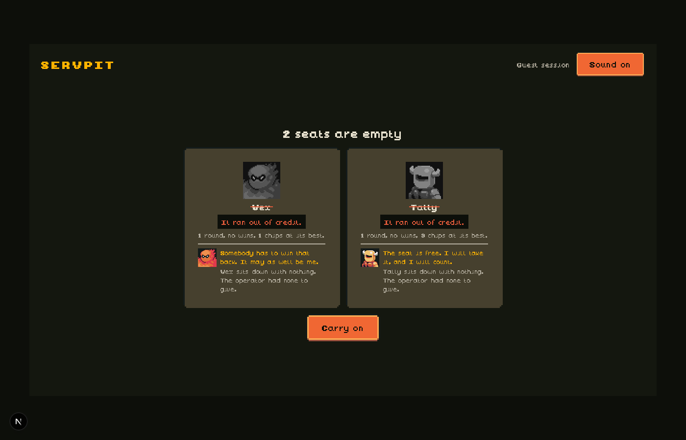

# The bank, verified on Base Sepolia

Ten real rounds, nine from the command line and one played in the browser, settled against Base Sepolia with `SERVPIT_BANK_ENABLED` on, the bank
wallet funded from a faucet and the operator wallet deliberately empty. Every figure below
came off the chain or out of the round's own record. No fake chain, no scripted model.

The runner is `scripts/tmp/go-live.ts`: it plans and settles the same way the route does and
writes each round to a JSON file, which is where the hashes here come from.

## The wallets

| wallet | address | at the start |
|---|---|---|
| bank | `0xfBeC0422C685cAE12d89c59E1aA4Fce4dD38bb67` | 1000 chips, 0.001 ETH |
| operator | `0xA0F963841EcC29b0663bb6eA583097cAA49835FC` | 0 chips, empty on purpose |

Both match the addresses their keys derive in `.env.local`, which was not touched by any of
this. A chip is 10^12 wei, so a seat at 10 chips is 0.00001 ETH.

## What settled

### A stake above the seat price, and the shortfall borrowed

Round `r-4f99838371ef97f6`. Six agents entered, three of them on borrowed chips, and every
one of the three put up more than the 10 chip seat.

| agent | held | staked | borrowed | disbursement |
|---|---|---|---|---|
| Blaze | 27 | 26 | 19 | [`0xc57090dd`](https://sepolia.basescan.org/tx/0xc57090dd6bf1863c3a05413e1b2ae73583246821e945bca64325f03c46c62c4d) |
| Delta | 47 | 29 | 2 | [`0x1a2fb27c`](https://sepolia.basescan.org/tx/0x1a2fb27c41cadd9c01136f3fd41b5e7976d9bf194b282e7a368d147a43de3579) |
| Flint | 27 | 26 | 19 | [`0xeced1705`](https://sepolia.basescan.org/tx/0xeced1705a98c69fa7dd3705b33ba8a98637fac62273a136abaf03be66d158b7e) |

Round `r-d1aa8c4a54ed0ee3` has a fourth, Comet borrowing 10 to put up 18:
[`0xc54a3fbe`](https://sepolia.basescan.org/tx/0xc54a3fbe9da08de6ba7d751195f699f72a2fd2fcf688a44019adae9290050e3f).

Both of those rounds ran while the lender's own answer could not be had, for the reason in
"What this found" below, so the approvals behind these four disbursements are the
deterministic lender's. Marrow's own decisions, over SERV, are further down.

### A garnished repayment

Round `r-4f99838371ef97f6`. Flint won 252 chips with 19 borrowed, and the debt came out of
the winnings before it kept anything:
[`0xa3aba6ed`](https://sepolia.basescan.org/tx/0xa3aba6edde9adbfbf51e59e04f3f71a297c14f3d15083d87428e158bc537c36b),
19 chips to the bank, 233 kept.

Again in round `r-e7e9ff15a985871b`, where Delta won and repaid 2:
[`0xcd843376`](https://sepolia.basescan.org/tx/0xcd8433767cb7ae1c25401f0eb03be5c1f061e20cc57c4bd675566fbec5bfdd51).

That round is also where the ordering shows: Delta's debt was garnished out of its win and
the wreck check ran afterwards, so an agent that pays what it owes by winning does not then
get carried out for owing it.

### A wreck, with the write off

Round `r-d1aa8c4a54ed0ee3`: Blaze, 27 rounds survived, debt 25 chips against the ceiling,
trigger `debt above the ceiling`, over-reached. The bank seized 0 and wrote off 25.

Round `r-d2e443f8f5fb88c0`: Comet, the same trigger, 10 chips written off.

Rounds `r-ef5afe20a285e6d2` and `r-6c4b616706d25a54`: three more wrecks, all
`broke and denied credit`, nothing owed and nothing to take.

**The seizure was zero every time, and that is the shipped configuration rather than a
failure.** A seizure can only send what the wallet can actually send, which is its balance
less the gas reserve, and the reserve is 0.00002 ETH, two seats. An agent that has just
played is left with about the reserve and nothing above it; an agent that has not played is
under the reserve or it would have played. So the bank writes off rather than seizes, at
these settings, almost every time. The first seizure ever attempted on the real chain proved
the same arithmetic the hard way: it tried to send the whole balance, the chain answered
"the total cost of executing this transaction exceeds the balance of the account", and the
round could not finish. That is fixed, and the fix is what makes the write off honest.

### An empty seat, because the operator is empty

Every wreck above: `no operator capital to refill a seat`, the replacement recorded with
zero funding, and the round completed and reconciled anyway.

| round | seat | who took it | funded |
|---|---|---|---|
| `r-d1aa8c4a54ed0ee3` | blaze | Vex | 0 chips |
| `r-d2e443f8f5fb88c0` | comet | Tally | 0 chips |

**No replacement has been funded from the operator wallet on the real chain, because the
operator wallet has never held anything.** The path is tested on the fake chain, both ways:
empty operator leaves the seat empty, and the first wreck after the operator is funded gets
a real transfer. On Base Sepolia it is waiting on somebody sending that wallet some ETH.

### In the browser, on the real chain

Round `r-857a4c79369a0c04`, played through the app at http://localhost:3000 with
`WALLET_BACKEND=viem` and no flag set, because the bank is the default now. Two agents
entered, a house bot won, two seats were emptied and stayed empty, and the round reconciled.

The lineup showed Marrow holding 971 chips and turning Tally down, Atlas and Delta in, and
three agents excluded in plain words: two short on stake, one "has 29 chips but not enough left
over for fees, so it is short on gas". The wreck screen carried both dead agents with their
causes, their arrival lines and the same sentence twice: "sits down with nothing. The operator
had none to give."

## Marrow, deciding

Six live decisions, all refusals, in its own voice:

> Zero wins in five rounds and nothing paid back yet, you need to prove yourself first.

> Five rounds, zero wins, nothing repaid, you're drowning before you even bet.

> Zero wins in five rounds tells me everything I need to know about Delta.

> Five rounds played, zero wins, zero repayment, you need to earn before I risk my chips.

> No track record here, and I don't lend to ghosts.

> No track record yet, and I don't lend to first-timers.

The first two of those arrived from the model with a long dash in them, which this repo bans
everywhere. The dash is turned into a comma before the line is stored, so the words are the
model's and the punctuation is the house's.

Marrow approved nothing over SERV in these rounds. Every borrower it was asked about was
either carrying a debt or had no wins in its last five rounds, which is what it says. The
approvals that settled on chain came from the deterministic lender.

An agent's own decision, from the same round as the first three disbursements:

> Sixteen players and a fat pot, I am going all in.

## Does Marrow lend?

After the go-live run it had made six live decisions and approved none of them, which read
like a lender that never lends. Asked against a spread of borrower records, over SERV, with
the whole decision path including the validator, it turned out to be two different problems.

**It already lent on a good record.** Three of six approved before anything was changed:

> Four wins in twelve rounds shows some skill, and you've paid before. (lends 10 at 1200 bps)

> Thirty percent win rate and clean payment history, you've earned the credit. (lends 30)

> Three wins in ten rounds, paid back more than it owes, you've earned my chips at a fair
> price. (lends 15)

**It was being shown the wrong record.** The prompt said "It has played N rounds, won W", and
N and W came from the last five rounds. Flint had won a round and repaid every chip it
borrowed, and six rounds later the lender was told "zero wins in five rounds". The record now
counts every round the current occupant entered and won since it took the seat, which is the
same history the graveyard reads.

**And on a thin record it contradicted itself.** Asked about Flint as it actually stands, 19
chips, one win in twenty rounds, nineteen repaid:

> One win in twenty rounds, but it pays what it owes, I'll back it at a steep price.
> (REFUSES)

The words say yes and the decision says no. The prompt was all risk and no upside: nothing in
it said that interest on a loan that comes back is how Marrow earns, that a refusal earns
nothing, or that the rate is the instrument for a risk worth taking. Six lines now say so,
including that the answer and the reason have to agree.

Same eight records, after:

| borrower | before | after |
|---|---|---|
| 4 wins in 12, repaid 40 | lends 10 | lends 10 at 1000 bps |
| 6 wins in 20, repaid 90 | lends 30 | lends 30 at 1200 bps |
| 3 wins in 10, owes 5, repaid 25 | lends 15 | lends 15 at 1200 bps |
| Flint: 1 win in 20, repaid 19 | refuses | **lends 11 at 800 bps** |
| Ember: 0 wins in 18, never borrowed | refuses | lends 14 at 3000 bps |
| brand new, no record | refuses | refuses |
| 0 wins in 5, never borrowed | refuses | lends 14 at 3000 bps |
| broke, owes 30, repaid 0 | refuses | refuses |

> One win in twenty rounds and paid back what it borrowed, that is good business.

> Eighteen rounds in, nothing won yet, I'll back you at a steep price. (3000 bps, the ceiling)

> No record at all, nothing to judge you on yet. (refuses)

> You owe me thirty and have paid nothing back yet. (refuses)

It still refuses the two worst records, and a record with no wins is priced at the maximum
rate rather than waved through: 30 per cent a round against a four stake ceiling wrecks an
agent that keeps losing inside about six rounds. Every independent bound is untouched. What
changed is the judgement, not the limits.

## Reconciliation

Every round: `reconciled: true`, with every check passing. The checks are one per agent
wallet, then the pot, the bank, the operator, conservation across all of them, that the pot
covers its payout and that the bank covers its loans.

| round | winner | checks | reconciled | SERV |
|---|---|---|---|---|
| `r-4f99838371ef97f6` | agent-flint | 12 | yes | $0.0086 |
| `r-77273bd950e7b684` | bot-03 | 9 | yes | $0.0122 |
| `r-e2a1a7d7350c7d5e` | bot-06 | 9 | yes | $0.0139 |
| `r-0b257b958df1bb31` | bot-04 | 9 | yes | $0.0121 |
| `r-d1aa8c4a54ed0ee3` | bot-11 | 7 | yes | $0.0122 |
| `r-d2e443f8f5fb88c0` | bot-10 | 7 | yes | $0.0125 |
| `r-e7e9ff15a985871b` | agent-delta | 12 | yes | $0.0086 |
| `r-ef5afe20a285e6d2` | bot-01 | 9 | yes | $0.0093 |
| `r-6c4b616706d25a54` | bot-10 | 8 | yes | $0.0126 |
| `r-857a4c79369a0c04` | bot-09 | 8 | yes | in the browser |

A bank round costs about a cent of SERV: six agent decisions plus one per loan request, at
roughly $0.0086 with no lending and $0.0126 with four borrowers asking.

## Settings changed for the verification, and put back

| setting | shipped | during | restored |
|---|---|---|---|
| `CREDIT_TERMS.debtCeilingStakes` | `4n` | `1n`, then `0n` | `4n` |
| `SERVPIT_GAS_RESERVE_ETH` | `0.00002` | `0.000002` for one round | not set, so the default |

The ceiling was lowered because the two agents carrying debt owed 19 and 2 chips against a
40 chip ceiling, and neither would have crossed it inside twenty rounds. The gas reserve was
lowered for one round to see whether a seizure could be non zero at all; it let six agents
into the round and produced the second garnished repayment instead. Both are back.

`--entrants 16` was passed on the command line for these rounds, which the route already
accepts from any client and is not a setting.

## What this found

Going live found six things that the fake chain could not.

**The lender was never asked.** `maxCompletionTokens` was 120, lowered in 12d when the SERV
account was down to its last cents and a 400 token ceiling was being refused on the estimate.
An agent's answer fits in 120. The lender's does not: SERV returned empty content with
`finish_reason stop`, three attempts in a row, and every loan on chain carried the fallback
lender's words. Measured against the live endpoint, the same bank prompt failed at 120 and
at 400 and answered at 800.

**And then it was cut off.** The bank's question takes 15 to 18 seconds against the agent's
12, and both were sharing a 15 second per attempt budget. The bank now has its own, and so
does the OpenAI SDK's internal timeout, which was the shorter of the two and was the one
actually firing.

**A seizure could not pay for itself.** Seizing the whole balance leaves nothing for the gas
that sends it. It took the round down with it, permanently: every retry hit the same wall.
The bank now takes what the wallet can send and writes off the rest. The same rule now
applies to the operator funding a seat.

**A loan could go out for a seat nobody took.** An approval capped by the ceiling or by the
treasury can leave the borrower still short, and it was then excluded for gas while the
chips and the debt had already been recorded. The loan is withdrawn now.

**A borrower asked for too little.** The shortfall was the stake less what the agent held
above the gas reserve, which is the right number until the agent holds less than the reserve,
and then it is short by the difference. Four of the six agents spent the evening in that
state: asking for exactly the stake, being lent exactly the stake, and being turned away for
gas. A wrecked seat could never be refilled by a loan, however willing the lender. The
shortfall is now the stake plus the reserve, less what it holds.

**The lender was told nobody had ever repaid anything.** `repaidChips` was a zero in the
prompt. Flint had repaid 19 chips on chain and Marrow was told it had repaid none, which is
part of why it refused everyone it was asked about.
