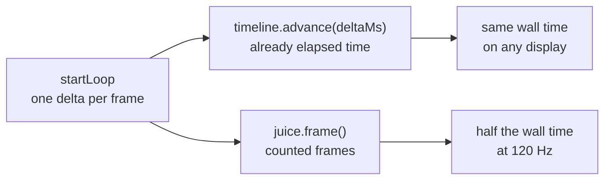

# Impact timing runs on elapsed time

The juice layer counted render frames. A frame is not a unit of time, so every
impact duration in the arena ran short on any display faster than 60 Hz. This
records what was wrong, what it measured, and what it measures now.

## The fault

`Juice.frame()` was called once per `requestAnimationFrame` callback and
decremented every actor timer by one. The durations were therefore in frames,
and a frame is whatever the display says it is.

The Timeline beside it was already delta driven and always had been. Only the
juice layer was not, so the fight advanced at the same speed everywhere while
the punctuation on top of it did not.

## What it measured

Measured on the machine this was written on, a 2560x1440 panel running at
144 Hz. Headless Chromium on the same machine reported a median
`requestAnimationFrame` delta of 11.9 ms, which is 84 Hz, not 60.

| duration | frames before | at 60 Hz before | at 120 Hz before | at 144 Hz before | after, any refresh |
|---|---|---|---|---|---|
| hitstop, death | 5 | 83.3 ms | 41.7 ms | 34.7 ms | 83.3 ms |
| hitstop, final blow | 8 | 133.3 ms | 66.7 ms | 55.6 ms | 133.3 ms |
| impact flash | 3 | 50.0 ms | 25.0 ms | 20.8 ms | 50.0 ms |
| knockback settle | 6 | 100.0 ms | 50.0 ms | 41.7 ms | 100.0 ms |
| punch settle | 8 | 133.3 ms | 66.7 ms | 55.6 ms | 133.3 ms |
| attack pose | 10 | 166.7 ms | 83.3 ms | 69.4 ms | 166.7 ms |
| corpse fade | 64 | 1066.7 ms | 533.3 ms | 444.4 ms | 1066.7 ms |

The 60 Hz column and the after column are the same number in every row. That is
the point: nothing about the intended look changed, and the displays that were
wrong are now right.

Why the after column is not the exact tick fraction

Each duration is a fraction of a tick. A sixth of a 320 ms tick is 53.3 ms, but
the frame counted build drew it as three whole frames, which is 50 ms at 60 Hz.
`ticksToMs` keeps that rounding so the 60 Hz look is bit identical to the build
it replaces rather than merely close to it. Every value sits within one 60 Hz
frame of its exact fraction, and dropping the rounding later is a one line
change in `src/config/playback.ts`.

Three things the conversion had to get right

**Effects keep moving while actors are frozen.** Hitstop freezes the fight, not
the world. `advance` runs the sheets and the emitter before it checks the
freeze, so sparks and smoke carry on through it.

**A long delta carries.** The frame counted version had no remainder to lose,
because a frame was the atom. With arbitrary deltas, a step longer than the
remaining freeze has to spend what the freeze is owed and pass the rest to the
actor timers. Swallowing the whole step would make the layer sensitive to how
big a step it is handed, which is the fault being removed.

**Floating point does not land on zero.** A countdown divided into equal deltas
leaves dust: ten steps of 1000/60 against 166.667 ms leave about 1e-14 ms,
enough to hold an attack pose one frame longer than it should. `drain` snaps
anything under a nanosecond to finished.

## How it is checked

`src/render/juiceFrameRate.test.ts` drives the same events through 60, 120 and
144 Hz delta streams and asserts each duration lasts the same wall time in all
three, within one step of the faster stream. One more test pushes a single one
second delta through and asserts nothing lingers.

## What a test cannot tell you

Whether the corrected timings feel right needs a person watching on a high
refresh display. Every number here is wall time. That an impact now reads with
the weight it was tuned for, rather than as a flicker, is a judgement no
assertion makes.

