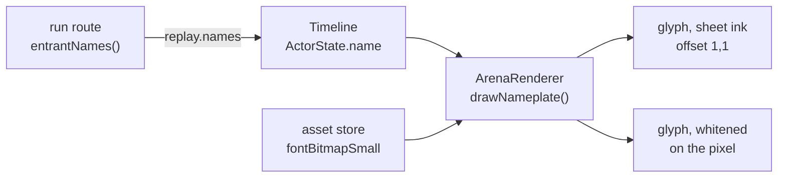
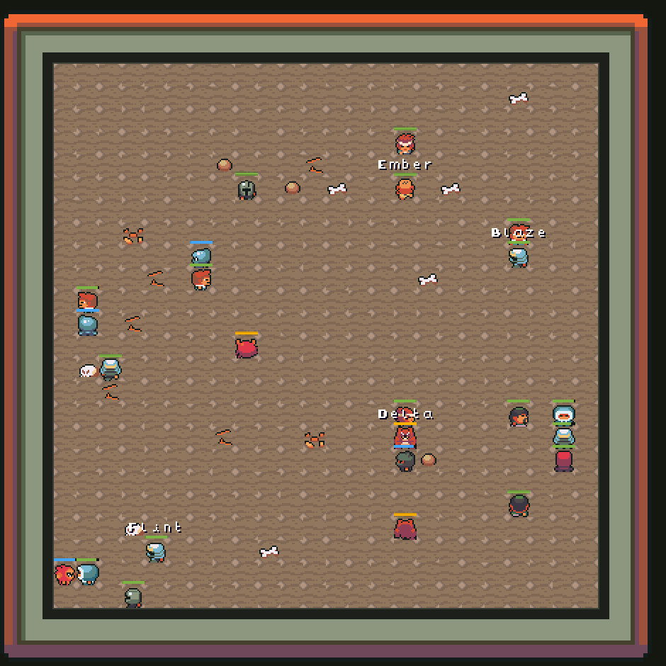
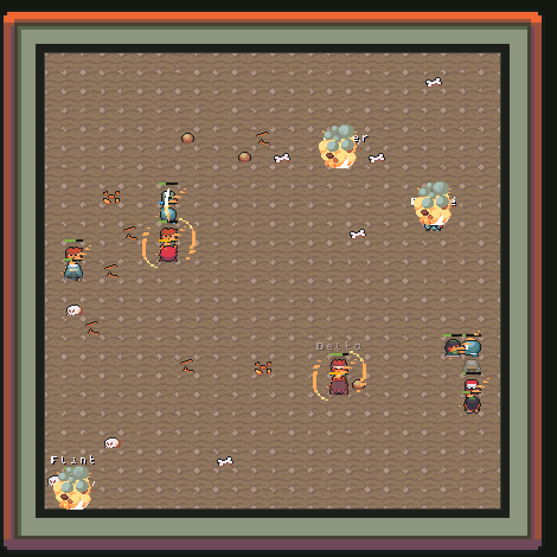

# Nameplates in the arena

Each entering agent's display name is drawn above its health bar. This records
what was built, what it looks like at twenty four entrants, and what a still
image cannot tell you about it.

## What it draws

The name travels with the replay. The combat engine works in entrant ids and
knows nothing about agents, so the server that knows both emits the mapping and
the renderer never takes an id apart.

## What it looks like

Four of the six agents entered this round, so four fighters carry a plate among
twenty four in the pit.

**It reads as informative, not as clutter.** Four labels in a 384 pixel arena
pick out the fighters with money on them and leave the rest as a crowd. The
house bots are unlabelled on purpose: a plate over one would read `bot-07` and
say nothing, and twenty four plates at eight pixels tall would be a wall of
text with the fighters behind it.

Mid round, with two agents down:

Delta's plate is grey rather than white here, because Delta is dead and the
name is fading with the corpse on the same alpha the sprite uses. Ember's is
partly behind a death smoke puff, which is the existing draw order working as
intended: effects are drawn after every actor.

Why two tones per glyph

The floor is tiled and scattered with detail, so it is not one colour. Across
the four base tiles and the six scatter sprites it presents fifteen distinct
colours, running from a near black crack at `#141b1b` to a near white bone at
`#f2eaf1`.

| tone | worst case against the floor |
|---|---|
| white ink alone | 1.18:1 |
| dark shadow alone | 1.16:1 |
| better of the two | 4.83:1 |

Neither tone is usable on its own. Together they clear 4.5:1 against every
colour the floor can present, and the worst case is the commonest brown rather
than an edge case. `src/ui/contrast.test.ts` asserts both halves of that.

Whole pixels, and the canvas edge

The arena is drawn at a whole number scale, so a glyph on a half pixel would
blur at every scale above one. The plate's left edge is rounded once, and the
glyphs step by a fixed eight from there.

The plate is also clamped to the canvas. The first build of this clipped: a
fighter standing against the right wall lost the back half of its name, because
the canvas clips and nothing was keeping the run inside it. A fighter on the
top row would have lost the plate entirely.

## What a still cannot tell you

**Whether twenty four nameplates would read as clutter cannot be answered from
these images, because this round never had twenty four of them.** Only agents
that enter get a plate, and four entered. A round where all six enter would
show six. The twenty four case does not exist by construction, which is the
answer to the question the brief asked, but it is an answer by design rather
than by measurement.

**Legibility in motion is not legibility in a still.** A name over a fighter
that is walking, being knocked back and overlapping two others for a third of a
second is a different reading problem than the same name held still. These are
single frames.

Measured on a 2560x1440 panel at 144 Hz.
